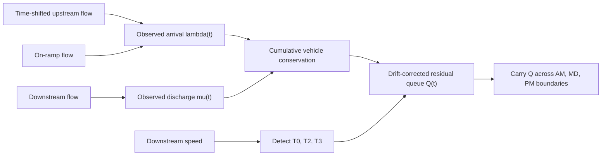
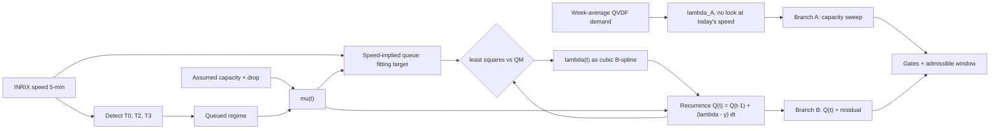

# Full-Day Single-Link Queue Reconstruction

Stage-A prototype for recovering a **continuous full-day residual queue** on one
freeway link, built twice against two different data sources.

The shared design requirement is that the 24-hour state is continuous. AM, MD,
PM and NT are labels for reporting only; they are not independent queue
simulations, and the queue is never reset merely because a period boundary is
crossed.

What separates the two parts is **where the queue evidence comes from**.

| | Part 1 — PeMS (I-405) | Part 2 — NVTA / INRIX (I-66) |
|---|---|---|
| Speed | observed, 5-minute | observed, 5-minute |
| Flow | **observed** at three detectors | **not available for this INRIX case** |
| `lambda(t)` arrivals | measured: upstream + on-ramp counts | inferred |
| `mu(t)` discharge | measured: downstream counts | inferred from an assumed capacity |
| `Q(t)` | cumulative count difference, drift-corrected | produced only by the recurrence |
| Speed is used for | episode timing and drift windows | the fitting target for arrivals |
| What the result is | a flow-conservation reference | a physically gated estimate with a range |
| Independent cross-check | speed vs counts are two separate witnesses | none available — see Finding 1 |

PeMS is the place where the conservation calculation can be *built and checked*,
because both link boundaries are measured. NVTA is the place where the method
must eventually *run* with speed as the only time-dependent observation. Part 2
is therefore not a direct port of Part 1; it is a different construction with a
strictly weaker claim attached.

## Dashboards

- [PeMS queue continuity](https://jacky850.github.io/I405--FDQ-dashboard/dashboard/full_day_residual_queue.html) · [source](dashboard/full_day_residual_queue.html)
- [NVTA speed-only queue continuity](https://jacky850.github.io/I405--FDQ-dashboard/dashboard/nvta_full_day_queue.html) · [source](dashboard/nvta_full_day_queue.html)
- [Speed-only QVDF holdout, observed vs inferred D and V](https://jacky850.github.io/I405--FDQ-dashboard/dashboard/qvdf_multiweek.html) · [source](dashboard/qvdf_multiweek.html)

Both are self-contained static HTML/CSS/JavaScript and draw their charts as
inline SVG. Local preview instructions are in each part's *Reproduce* section.

---

# Part 1 — PeMS: the queue is counted

PeMS provides speed and flow at the same five-minute resolution. Speed
identifies the congestion episode; observed upstream, ramp and downstream flows
provide the boundary counts for a conservation-based queue. The model never has
to pretend that speed alone determines flow.

## Case

| Item | Value |
|---|---:|
| Date | 2025-07-29 |
| Time zone | America/Los_Angeles |
| Resolution | 5 minutes, 288 bins |
| Target/downstream link | L405S-004 |
| Upstream link | L405S-041 |
| Upstream mainline detector | 1201497 |
| On-ramp detector | 1201517 |
| Downstream detector | 1201525 |
| Segment length | 1.480596 km |

This is one **observed Tuesday**, not an average-weekday profile. A real day was
chosen deliberately, because the question is whether a physical queue survives a
reporting-period boundary. The repository carries a minimal reproducible input
with only the three selected detectors:

```text
data/pems_single_link_2025-07-29_L405S-004.csv.gz
```

Each detector has all 288 records. Flow is converted from vehicles per
five-minute bin to veh/h inside the script; speed is already in mph.

## Logic chain



### 1. Build a single 24-hour clock

All three detector series must contain the same 288 timestamps. Upstream
mainline flow is shifted by the approximate free-flow travel time to the
downstream detector. The observed rates are then

$$
\lambda_{\mathrm{obs}}(t)
=q_{\mathrm{upstream}}(t-\tau)+q_{\mathrm{ramp}}(t),
\qquad
\mu_{\mathrm{obs}}(t)=q_{\mathrm{downstream}}(t).
$$

The ramp has observed flow on this date, so no ramp imputation is used.

### 2. Identify the congestion episode from speed

Downstream speed is smoothed with a centred three-bin median. The free-flow
reference is the 95th percentile of the full-day smoothed speed. Congestion
begins below 70% of that reference and ends after two consecutive bins at or
above 75%. Episodes shorter than 20 minutes are discarded.

| Parameter | Result |
|---|---:|
| Free-flow speed | 70.465 mph |
| Entry threshold | 49.326 mph |
| Exit threshold | 52.849 mph |
| T0 | 07:25 |
| T2, minimum-speed time | 09:55 |
| T3 | 10:25 |
| Congestion duration | 185 minutes |
| Minimum speed | 10.7 mph |

T2 is the observed minimum-speed bin and T0/T3 are detected independently. No
artificial symmetry around T2 is imposed.

### 3. Recover the count-based reference queue

Vehicle conservation is integrated across the whole day with
$\Delta t=5/60$ hours:

$$
C_{k+1}=C_k+
\left[\lambda_{\mathrm{obs}}(k)-\mu_{\mathrm{obs}}(k)\right]\Delta t.
$$

Upstream and downstream detectors can carry a small persistent count mismatch.
Accumulated for hours, that drift looks like a large queue even in free flow.
The implementation takes one-hour free-flow windows before and after the
episode, fits a linear baseline $B_k$ between their median cumulative levels,
and defines

$$
Q_k^{\mathrm{count}}=\max\left(0,\ C_k-B_k\right).
$$

This removes only the measured linear detector drift. It does not fit the shape
or the peak of the queue.

### 4. Carry the residual queue across periods

One continuous state equation, with realised outflow bounded by both available
vehicles and service rate:

$$
Q_{k+1}=\max(0,\;Q_k+(\lambda_k-y_k)\Delta t),
\qquad
y_k=\min(\mu_k,\;\lambda_k+Q_k/\Delta t).
$$

At 09:00 the reporting label changes from AM to MD, but the count-based queue is
**354.14 vehicles** — its maximum for the day. It clears only after the
speed-recovery gate at 10:30, not at the period boundary.

Both parts now cut AM→MD at 09:00, following the whole-day DTA period spec. The
boundary is the `--period-boundaries` argument, defaulting to `6 9 15 19`. The
earlier version cut at 10:00 and reported 255.44 vehicles at the handoff; moving
to the spec boundary **strengthens** the result, because 09:00 lands on the queue
peak rather than on its drain-down.

## What PeMS lets us check

**A. Detector coverage and topology.** Median percent-observed is 100% on all
three detectors. Arrivals contain upstream mainline plus on-ramp; discharge is
the downstream mainline. Omitting the ramp would violate conservation.

**B. Vehicle conservation and period continuity.** The queue comes directly from
observed counts, the recurrence uses the previous five-minute state throughout,
and its value at the AM→MD boundary is 354.14 vehicles — the implementation does
not reset state when the label changes.

**C. Speed-implied diagnostic comparison.** The CSV retains an experimental
speed-delay queue

$$
Q_k^{\mathrm{speed}}
=\mu_k\max\left(0,\ \frac{L}{v_k}-\frac{L}{v_k^{\mathrm{baseline}}}\right),
$$

peaking at 404.54 vehicles. Against the count-based queue its episode MAE is
81.72 vehicles, correlation 0.485, and **the two peak times differ by 60
minutes**. Speed captures the broad buildup and dissipation but does not recover
the physical queue accurately enough to replace counts.

That 60-minute gap is the single most valuable number in Part 1, because counts
and speed are two *independent* witnesses. Part 2 loses that independence — see
Finding 1.

## D. The closure test

Walk the chain to the end and compare against counts that never entered it.

**Two things are called closure and only one is evidence.**

*Internal closure* puts the same $\lambda$ and $\mu$ back into the same
conservation equation and checks that $Q$ reproduces. Result:
$1.42\times10^{-13}$ vehicles. This is an algebraic identity. It verifies the
implementation and says nothing about the physics.

The speed round-trip is the same trap wearing a different hat. Reconstructed
speed is $L/(t_{\mathrm{base}}+Q/\mu)$ while $Q=\mu\,(t_{\mathrm{obs}}-t_{\mathrm{base}})$,
so the two cancel and the observed speed comes back by construction. Its 1.23
mph residual is the rolling median applied to $Q$, not model skill. **Neither
number may be quoted as validation.**

*External closure* is the real test:

| Period | Observed arrivals | Back-calculated | Error | | Q at start | Q at end |
|---|---:|---:|---:|---:|---:|---:|
| NT1 | 10,881 | 10,890 | +9 | +0.08% | 0 | 0 |
| AM | 28,494 | 29,119 | +625 | +2.19% | 0 | 116 |
| MD | 46,458 | 47,879 | +1,420 | +3.06% | 116 | 0 |
| **PM** | 30,217 | 32,860 | **+2,643** | **+8.75%** | 0 | 0 |
| NT2 | 19,681 | 19,916 | +235 | +1.20% | 0 | 0 |
| **Whole day** | **135,732** | **140,664** | **+4,932** | **+3.63%** | 0 | 0 |

**The whole-day row is structurally pinned and must not be read as accuracy.**
Since $\lambda_{\mathrm{inferred}}=\mu+\mathrm{d}Q/\mathrm{d}t$ and $Q$ opens and
closes the day empty, the 24-hour inferred volume is *identically* the 24-hour
integral of $\mu$ — verified at 0.000000 vehicles difference. The whole-day
figure scores the assumed service rate, not the queue. **Only the per-period
split tests the queue**, because there $Q$ carries a non-zero boundary state.

Two things stand out. PM is the outlier at +8.75% against 0.08–3.06% elsewhere,
consistent with S3 reading high free-flow speed as high demand. And every period
errs in the same direction, so this is a bias, not noise.

### The accuracy floor

| | vehicles |
|---|---:|
| Upstream + ramp counted in | 135,732 |
| Downstream counted out | 140,380 |
| **Imbalance** | **−4,648 (−3.42%)** |

Over a day that starts and ends with an empty queue these must be equal. They
are not. **The two witnesses disagree by 3.42%, which is the same size as the
3.63% whole-day closure gap** — so that gap is largely detector calibration, not
model error. No closure figure on this case can be trusted below roughly 3.4%
until the detector imbalance is explained.

This is what a closure test is for: it found a data problem the queue
mathematics could not have revealed.

## What Part 1 does not establish

PeMS observes speed and detector flow. It does **not** observe the number of
queued vehicles. So this is a **flow-conservation-based queue estimate**, not an
observed queue ground truth, and its values remain conditional on detector
topology, the upstream travel-time shift, ramp inclusion, drift correction and
the initial-queue assumption.

The near-zero recurrence closure error verifies implementation consistency only.
It is expected whenever the same $\lambda(t)$ and $\mu(t)$ are placed back into
the same conservation equation.

Future validation should triangulate with (1) multi-detector time-space
analysis, (2) occupancy-based queue length converted through a defensible jam
density, and (3) an established CTM/LWR/PAQ method run on the same boundaries.

## Reproduce

```powershell
python scripts/run_pems_full_day_single_link.py `
  --raw-file data/pems_single_link_2025-07-29_L405S-004.csv.gz `
  --output-dir outputs/pems_full_day_residual_queue_2025-07-29_L405S-004 `
  --period-boundaries 6 9 15 19

python scripts/build_full_day_residual_dashboard_data.py `
  --input-dir outputs/pems_full_day_residual_queue_2025-07-29_L405S-004 `
  --output dashboard/full_day_residual_data.js

python scripts/stamp_dashboard_assets.py

python -m http.server 8772
```

Then open `http://127.0.0.1:8772/dashboard/full_day_residual_queue.html`.
Requires `numpy` and `pandas`.

## Files

| File | Purpose |
|---|---|
| `scripts/run_pems_full_day_single_link.py` | Episode, conservation, queue and consistency pipeline |
| `data/pems_single_link_2025-07-29_L405S-004.csv.gz` | Minimal three-detector input |
| `outputs/pems_full_day_residual_queue_.../full_day_timeseries_5min.csv` | 288-bin output with speed, flow, lambda, mu, queue |
| `outputs/pems_full_day_residual_queue_.../congestion_episodes.csv` | T0, T2, T3, duration, queue peaks |
| `outputs/pems_full_day_residual_queue_.../closure_by_period.csv` | Closure test: observed vs back-calculated volume per period |
| `outputs/pems_full_day_residual_queue_.../summary.json` | Case summary, boundary states and closure test |
| `scripts/build_full_day_residual_dashboard_data.py` | Static dashboard payload |
| `scripts/stamp_dashboard_assets.py` | Hash-stamps CSS/JS links so browsers cannot mix stale styles with fresh markup |
| `dashboard/full_day_residual_queue.html` | Dashboard entry point |

---

# Part 2 — NVTA / INRIX: the queue is inferred

## Why Part 1 does not simply port

The core of the PeMS pipeline is `lambda = upstream + ramp counts` and
`mu = downstream counts`. **Neither exists on NVTA.** There is no flow
measurement at any boundary and no occupancy series. Both sides of the
conservation equation have to be constructed, which changes three things at
once:

1. Conservation stops being a *test*. On PeMS both boundaries are measured, so
   conservation checks something. On NVTA the boundaries are authored, so
   conservation holds by construction and proves only that the code is
   self-consistent.
2. The cross-check disappears. Part 1's 60-minute peak-time gap has meaning
   because counts and speed are independent. If arrivals are recovered from
   speed and then used to reproduce speed, the loop is closed and proves
   nothing. Recovering that independence is the whole reason Part 2 carries a
   second branch.
3. The dominant error source changes — from detector drift and topology, to the
   capacity assumption, to the identifiability of flow at free-flow speed.

## Case

| Item | Value |
|---|---|
| Link | TMC `110-04178`, network link `31800`, I-66 EB, Fairfax County |
| Geometry | 1.045 mi, 4 lanes |
| Day | 2025-10-08, 288 five-minute bins, zero missing |
| Clock | continuous minutes 360–1800 (06:00 to 06:00 next morning), **no midnight reset** |
| Periods | AM 360–540, MD 540–900, PM 900–1140, NT 1140–1800 |
| Speed episodes | E1 06:22→10:25 (P 4.04 h, v(T2) 16.8 mph), E2 14:20→18:54 (P 4.57 h, v(T2) 22.5 mph) |

The clock follows the whole-day DTA period spec, so NT runs past midnight to
minute 1800 rather than wrapping. E2's asymmetry ratio is **0.22** — onset takes
50 minutes, recovery takes 3.7 hours — while the PM period midpoint is 17:00 and
the observed T2 is 15:10. That alone is a 110-minute argument against pinning t2
at the assignment-period midpoint.

## What we found

These are the findings that changed the design. Each one is measured on this
data, not assumed.

### Finding 1 — the QVDF arrival rate is served flow, not arrival demand

NVTA's QVDF demand is produced by inverting speed through an S3 fundamental
diagram. That inversion returns the **congested branch**, so it is capped at
capacity by construction:

```text
whole-day maximum of the S3-inverted flow   2199.8 vphpl
assumed capacity                            2200.0 vphpl
average over the 4-hour AM episode          1789   vphpl  = 0.81 x capacity
observed minimum speed in that episode        16.8 mph
```

A demand at 81% of capacity cannot produce a queue, yet the link is congested
for four hours. Queues are caused by *arrivals* exceeding *service*, but the S3
inversion measures what got **through**. The method has no channel through which
demand can exceed capacity, so it cannot represent the cause of the queue it is
trying to explain.

### Finding 2 — `D/C` in the QVDF table is a rescaled duration

In `qvdf_core.py`, `D` is the per-lane **volume** accumulated over T0..T3, and
`DC = D / cap` divides that volume by a **rate**, which has units of hours.
Across 296 link-periods in the NVTA calibration:

```text
corr(DC, P) = 0.856        mean DC/P = 0.894 +/- 0.152
```

So `D/C = 4.62` on this link does not mean "demand is 4.6x capacity"; it means
the episode accumulated about 4.6 hours' worth of capacity flow, next to an
observed episode 5.34 hours long. The QVDF duration branch `P = f_d (D/C)^n` is
then fitting duration against something that is essentially duration.

### Finding 3 — the parameters are a week average applied to a single day

`observed_t2_dataset` carries `date='SelectedWeekAverage'`: five weekdays are
averaged bin by bin **before** episode detection. Averaging fills the trough and
widens the window. Measured on this link (AM, cutoff 49 mph):

| | P (h) | v(T2) (mph) |
|---|---:|---:|
| single days, mean of 5 | 5.70 | 17.9 |
| week-average curve | 6.42 | 20.8 |

Against the observed day, the calibration is off by **−1.30 h in P and
−5.15 mph in v(T2)** for AM, and **−1.10 h / −6.64 mph** for PM. T0 and T2 stay
close (4 and 5 minutes for AM) but **T3 is off by 74 minutes** — the same
"T0/T2 reliable, T3 not" pattern the PeMS side found independently.

The two biases push `D/C` in opposite directions (longer P raises it, higher
v(T2) lowers it), so the net effect has to be measured rather than assumed.

### Finding 4 — capacity and free speed are hardcoded, and free speed is not unique

The NVTA calibration sets `capacity = 1800 if HOV else 2200` and
`free_flow = 65 if HOV else 70`. These are planning constants, not fits. For
this link four mutually inconsistent free-speed values exist:

```text
62.0  INRIX reference speed
66.6  observed 95th percentile
69.0  network attribute
70.0  QVDF calibration constant
```

a 13% spread on a quantity that sets free-flow travel time and therefore feeds
straight into the speed-implied queue.

### Finding 5 — a pointwise queue has no state

`Q(t) = (L/v(t) − L/v_f) · mu(t)` reads each bin independently and never uses
`Q(t−1)`. Because `1/v` is steep at low speed, a 4.48 mph bin-to-bin speed
deviation becomes a queue swing of **165 vehicles — half the daily maximum**,
implying a flow imbalance of 1979 veh/h reversing every five minutes. A queue is
a stock; stocks cannot do that.

### Finding 6 — the PeMS discharge calibration cannot be carried over

`k_mu = mu_e / C` looks clean at a median of 0.52, but only because numerator
and denominator are divided by the same suspect lane count, cancelling the
error. Converted to per-lane units — the only unit that transfers between
regions — 14 of 35 PeMS link-periods fail a physical plausibility gate:

```text
L405S-018   FD capacity 2870 vphpl
L405S-115   FD capacity 5418 vphpl, discharge 3170 vphpl   (2 lanes, 81 m)
six link-periods   discharge below 1200 vphpl
```

No freeway lane exceeds roughly 2400 vphpl. The audit branch
`audit/i405-perlane-gate` adds the gate but is diagnostic only: the root cause
(lane counts, the FD capacity fit, or flow units) is still open.

## What we changed because of it

| # | Finding | Adjustment |
|---|---|---|
| 1 | S3 returns served flow | Branch A was **reframed from a second queue estimate into a falsification test**, run as a capacity sweep instead of a single curve |
| 2, 3 | `D/C` is duration; parameters are a week average | The week-average parameters are used **as-is**, deliberately, so Branch A tests the deployed chain rather than a re-fitted one; the deviation table above ships as a diagnostic |
| 4 | free speed is not unique | Free speed became a **sensitivity input**, swept over all four candidates rather than chosen |
| 5 | a pointwise queue has no state | `lambda(t)` is now a **smooth spline** and `Q(t)` is produced **only by the recurrence**, so the state always carries `Q(t−1)` |
| 6 | PeMS per-lane values fail a gate | `mu` was isolated into a **replaceable config with provenance**; PeMS values are recorded there but not used as input |
| — | boundaries are inferred, not measured | Two gates are reported **`not_testable`** rather than silently passed |

The fifth adjustment is the substantive one. Reversing the causal direction:

```text
before   speed --> pointwise Q --> lambda by differencing --> recurrence (reproduces itself)
after    smooth lambda --> recurrence --> Q  ...  fitted against the speed-implied Q
```

Consequences:

- `Q(t)` carries `Q(t−1)` by construction and cannot jump. The largest
  adjacent-bin step falls from 165 to **47 vehicles**. The observed speed is
  not smoothed for this fit; temporal regularity comes from the spline arrival
  representation and the recurrence.
- The closure error stops being a tautology. Before it was 1e-13 — the
  recurrence reproducing its own inputs. Now it is a **residual RMSE of 22.4
  vehicles** against the constructed speed-implied target. This measures how
  closely a smooth-arrival conservation model can approximate that target; it
  is **not** queue accuracy and is not converted into an explained percentage.
- Speed smoothing was **removed**. It had been added to declare a minimum queue
  time scale; once the recurrence supplied the inertia, the physical constraint
  replaced the cosmetic one.

## Logic chain



For **Branch B**, the service-rate prior is

$$
\mu_k=
\begin{cases}
n_{\mathrm{lane}}C, & k\text{ outside a detected episode},\\
n_{\mathrm{lane}}C(1-\delta), & k\text{ inside a detected episode},
\end{cases}
$$

where the default is $C=1900$ vphpl and $\delta=0.10$. The observed speed first
defines a pointwise fitting target,

$$
Q_k^{\mathrm{speed}}
=\mu_k\max\left(0,\frac{L}{v_k}-\frac{L}{v_f}\right).
$$

Arrival flow is then represented as a nonnegative cubic B-spline,
$\lambda_k=B(t_k)\beta$, with 27 basis functions and 60-minute knot spacing.
The coefficients are fitted so that the queue generated by the continuous
recurrence

$$
y_k=\min\left(\mu_k,\lambda_k+\frac{Q_k}{\Delta t}\right),
\qquad
Q_{k+1}=\max\left(0,Q_k+(\lambda_k-y_k)\Delta t\right)
$$

approximates $Q_k^{\mathrm{speed}}$. Thus the reported queue is the recurrence
state, not the pointwise delay conversion. The fit identifies $\lambda(t)$ only
where either target or recurrence queue exceeds 0.5 vehicle: **117 of 288 bins**
in the default run. In the other 171 free-flow bins, speed alone cannot
distinguish among arrival rates below service capacity.

**Branch A** takes each AM/PM episode volume from the week-average QVDF table,
divides it by that calibrated episode duration, and uses the resulting average
rate as `lambda_A(t)` inside the episode. The QVDF whole-day share supplies a
uniform residual rate outside the episodes. Branch A never looks at this day's
speed, which makes it computationally separate from Branch B. Because of
Finding 1, however, it is a falsification/sensitivity branch rather than an
independent queue ground truth.

## Result

```text
Peak queue            272 veh   [251-343 over 36 assumption combinations]
Peak time             08:05     [07:50-08:05]
Q at 09:00 AM->MD     198 veh   [181-250]
Q at 15:00 MD->PM     197 veh   [166-225]
Q at 19:00 PM->NT       0 veh
End of day              0 veh
Residual RMSE        22.4 veh   vs the speed-implied queue
```

The queue is carried across **two** reporting boundaries. The second is the
sharper demonstration: **the PM episode begins at 14:20, inside MD**, so by the
15:00 boundary 197 vehicles have already accumulated. A period-by-period run
would start PM from zero and lose them.

Sensitivity is dominated by `mu`, as expected from `Q = delay x mu`: capacity
+16% moves the peak +16%, capacity drop 5%→15% moves it −11%, and free speed
62→70 mph — a 13% change — moves it only **+4%**. The four contradictory
free-speed values turned out not to matter much.

### Branch A: the gate that fails, and why that is the useful part

The whole 16-point sweep collapses to one inequality. A queue exists only when
`lambda_A > mu`:

$$
C_{\mathrm{crit}}=\frac{\lambda_A}{1-\delta}=\frac{1949.6}{0.90}=2166\ \text{vphpl}
$$

and expanding `lambda_A` shows where that number comes from:

$$
C_{\mathrm{crit}}=\frac{0.886\times 2200}{0.90}
$$

— the S3 congested-branch average, the assumed capacity, and the assumed
capacity drop. **Not one of the three comes from the observed day.**

Screening the sweep on three physical conditions — a queue must exist (four
hours below 30 mph), it must fit inside the link's 836-vehicle storage, and it
must clear by the end of the day:

| Assumed capacity | Peak queue | Admissible |
|---:|---:|---|
| 1900 (HCM) | 5,494 veh | no — 6.6x storage |
| 2100 | 1,810 veh | no |
| 2150 | 985 veh | no |
| **2200** | **160 veh** | **yes — the only one** |
| 2250 | 0 veh | no — contradicts 4 h at 16.8 mph |

The admissible window has **zero width**. Across the sweep the peak spans 0 to
35,548 vehicles. And 2200 vphpl is exactly the capacity that was assumed when
the S3 inversion generated the demand in the first place, so its appearance in
the output is circular, not evidence. At the **same 2200-vphpl capacity**, Branch
A gives 160 vehicles peaking at 18:55, whereas the corresponding Branch B
speed-implied target gives 381 vehicles peaking at 07:55 — a 2.4x magnitude gap
and a 10-hour-50-minute timing gap. These are deliberately separated from the
headline Branch B result above, which uses the default 1900-vphpl HCM prior.

The conclusion is not that QVDF is wrong by some percentage. It is that on this
link **the answer is governed by an unknown capacity, and the physically
plausible range of that capacity spans three orders of magnitude of queue**.
That is a different failure from being inaccurate, and it is consistent with the
NVTA corridor evidence table where duration MAE runs 15–549 minutes and IoU
0.0–0.18 across eleven corridors.

## Gates

**4 pass · 1 fail · 2 not testable**

| Gate | Verdict | Basis |
|---|---|---|
| G1 vehicle conservation | pass | `Q >= 0`, produced only by the recurrence, no boundary reset. Structural — not evidence of magnitude |
| G2 speed consistency | pass | Peak inside a speed episode; night queue 0.01 veh over a 63 mph free-flow night; residual RMSE 22.4 veh |
| G3 spatial storage | pass | Worst case 343 veh against 836 veh of storage; no spillback |
| G4 occupancy consistency | **not testable** | INRIX provides speed only; no occupancy series exists |
| G5 boundary flow quality | **not testable** | No flow measurement at any boundary, so the gate has no input |
| G6 temporal persistence | pass | Largest adjacent-bin step 17% of peak; raw speed is unsmoothed, while arrivals use a 60-minute-knot spline |
| G7 cross-method agreement | **fail** | Branch A carries no independent information — see above |

G2 also reports 43.9 vehicles (16% of peak) surviving just past the speed-defined
episode end. That is the recurrence draining down after the speed threshold is
crossed, which is physically right and which the old hard-zeroed pointwise
formula could not show.

**This is not an accuracy validation.** Both boundaries are inferred and no
independent measurement of queue exists, so the reported range reflects
assumption spread, not measurement error. Branch B is an internal consistency
result.

## Reproduce

```bash
python scripts/prepare_nvta_full_day_link.py --speed-file <i66eb_raw_5min.csv> --mapping-file <corridor_tmc_mapping.csv> --qvdf-file <observed_t2_dataset_week_2025-10-06_to_10.csv> --data-dir data/nvta_i66eb_31800_2025-10-08 --output-dir outputs/nvta_full_day_single_link_2025-10-08_31800
```

```bash
python scripts/run_nvta_full_day_queue.py --data-dir data/nvta_i66eb_31800_2025-10-08 --output-dir outputs/nvta_full_day_single_link_2025-10-08_31800 --mu-config configs/nvta_mu_prior.json
```

```bash
python scripts/run_nvta_full_day_gates.py --data-dir data/nvta_i66eb_31800_2025-10-08 --output-dir outputs/nvta_full_day_single_link_2025-10-08_31800 --mu-config configs/nvta_mu_prior.json
```

```bash
python scripts/build_nvta_full_day_dashboard_data.py --input-dir outputs/nvta_full_day_single_link_2025-10-08_31800 --data-dir data/nvta_i66eb_31800_2025-10-08 --output dashboard/nvta_full_day_data.js
```

Branch B needs `scipy` in addition to `numpy` and `pandas`. The gate sweep runs
36 spline fits and takes a few minutes.

## Files

| File | Purpose |
|---|---|
| `scripts/prepare_nvta_full_day_link.py` | Extract one TMC onto the continuous clock; detect episodes |
| `scripts/run_nvta_full_day_queue.py` | Spline arrivals, recurrence queue, Branch A capacity sweep |
| `scripts/run_nvta_full_day_gates.py` | 36-case sensitivity, per-bin envelope, gate verdicts |
| `scripts/build_nvta_full_day_dashboard_data.py` | Static dashboard payload |
| `configs/nvta_mu_prior.json` | **Replaceable service-rate input** with provenance |
| `data/nvta_i66eb_31800_2025-10-08/` | Minimal reproducible input: 288 bins plus link attributes |
| `outputs/.../full_day_queue_5min.csv` | 288 bins: speed, mu, lambda, recurrence queue, measurement queue, Branch A |
| `outputs/.../branch_a_capacity_sweep.csv` | Capacity sweep with admissibility flags |
| `outputs/.../sensitivity_grid.csv` | 36 assumption combinations |
| `outputs/.../queue_envelope.csv` | Per-bin min/median/max across the sweep |
| `outputs/.../gate_report.json` | Gate verdicts, ranges, abstentions |
| `dashboard/nvta_full_day_queue.html` | Dashboard entry point |

`configs/nvta_mu_prior.json` exists so that a corrected discharge calibration can
be swapped in without touching code, and so that the current values are visibly
assumptions rather than measurements.

---

# Part 3 — Speed-only QVDF holdout: what the inversion actually predicts

Parts 1 and 2 reconstruct a queue on one day. Part 3 asks a narrower question on
I-405: **hide a week, keep only its speed, and see which of the QVDF's outputs
survive contact with the hidden flow.** Twelve ordinary complete weeks, seven
links, AM and PM: 168 link-week cases, leave-one-week-out.

## What is a prediction and what is not

This distinction decides how every number below should be read.

| Quantity | Source | Status |
|---|---|---|
| `P` congestion duration | detected in the holdout speed profile | **input** |
| `v_c` cutoff speed, `T2` | detected in the holdout speed profile | **input** |
| `f_d`, `n`, `f_p`, `s`, `C`, `k_d` | median over the eleven training weeks | frozen |
| `D/C`, `D`, `V` | inverted from `P` | prediction |
| `v(T2)`, full speed curve | forward severity branch | prediction |

`P` is inverted to obtain `D/C`, so pushing `D/C` back through the duration
branch returns `P` exactly. **A "predicted duration" would be a tautology and is
not reported.** The meeting shorthand calls duration "D"; in every equation here
`D` is the peak demand *rate*, so the columns are named
`congestion_duration_P_h`, `demand_D_*` and `volume_V_*` to keep them apart.

## A. Observed vs inferred demand and volume

Per case, side by side with the difference:

| | MAPE | MAE | bias |
|---|---:|---:|---:|
| Peak demand `D` | **16.00%** | 1,371 veh/h | −426 |
| Period volume `V` | 16.51% | 4,916 veh | −1,465 |
| Inferred `D/C` | 17.29% | 0.20 | −0.16 |
| Minimum speed `v(T2)` | — | 2.21 mph | — |

**Coverage is 21 of 168 cases (12.50%).** The method abstains on the rest: 137
have no canonical speed episode, 7 fail the speed-consistency gate, 3 fail the
duration-extrapolation gate. Over all 31 episode cases *before* the gates,
demand MAPE is 30.08% and volume MAPE 31.38%. The error figure and the coverage
figure only mean something together.

**`V` and `D` are not two independent checks.** `V_inferred = D_inferred / PLF`
with a per-link peak-load factor calibrated on the training weeks, so the two
near-identical percentages are one estimate reported in two units.

## B. Forward projection: the inferred state back through the speed map

The scalars above stop at one speed value, `v(T2)`. The forward projection
produces a speed for every five-minute bin of the period and scores it against
the observed profile:

$$
v(t)=\frac{v_c}{1+z\left(1-\tau^{2}\right)^{2}},
\qquad \tau=\frac{2\left(t-T_2\right)}{P},
$$

with `z = f_p · P^s` frozen on the training weeks, and free-flow speed asserted
outside `|τ| ≤ 1`. A constant free-flow speed is scored alongside as the null
baseline — without it a speed MAE in mph is not interpretable, because most bins
of a period are not at the bottom of the dip.

| Window | Forward MAE | Bias | Skill vs free-flow |
|---|---:|---:|---:|
| Modelled congestion window | **4.86 mph** | −0.28 | 0.958 |
| Observed episode `[t0, t3]` | 6.76 mph | +3.94 | 0.882 |
| Whole period | 8.48 mph | +4.92 | 0.784 |

Free-flow baseline over the whole period: 23.79 mph MAE. Worst single bin: 34.6
mph.

### The error is at the episode edge, not in the depth of the dip

Two results point the same way.

**The severity branch is not the binding constraint.** Handing the model the
*observed* depth instead of the predicted one — `z` from the measured `v(T2)`
rather than from `f_p · P^s` — improves the congested-window MAE only from 4.86
to 4.47 mph. The frozen severity branch is close to right.

**The boxcar edge is.** Splitting the period error at the model's own episode
boundary:

| | share of bins | share of squared error | MAE | bias |
|---|---:|---:|---:|---:|
| Inside the modelled episode | 62.1% | 27.4% | 5.32 mph | −0.42 |
| Outside, model asserts free flow | 37.9% | **72.6%** | 13.68 mph | **+13.67** |

Inside its own window the model is essentially unbiased. Outside it the error is
one-sided and large, because the road is not at free flow there: **79.6% of
those bins are below 90% of free speed and 32.5% are below the cutoff speed
`v_c` that the model itself uses to define congestion.** Across the period 67.3%
of bins are congested by that definition while the modelled episode covers
62.1%.

A related misalignment: the QVDF episode is symmetric about `T2`, the detected
one is not. `T2` sits 8.1 minutes off the episode midpoint on average and up to
64.6 minutes.

So the speed model's weakness is not that it mis-sizes congestion. It is that
congestion has a hard on/off edge in the model and a long tail in the data.

## Reproduce

```powershell
python scripts/run_i405_multiweek_average_holdout.py
python scripts/build_i405_observed_vs_inferred_d_v.py
python scripts/run_i405_forward_projection_speed.py
python scripts/build_i405_multiweek_dashboard_data.py
```

## Files

| File | Purpose |
|---|---|
| `scripts/run_i405_multiweek_average_holdout.py` | Leave-one-week-out inversion and gates |
| `scripts/build_i405_observed_vs_inferred_d_v.py` | Observed vs inferred `D` and `V` per case |
| `scripts/run_i405_forward_projection_speed.py` | Forward speed projection and error decomposition |
| `outputs/i405_multiweek_average_holdout/observed_vs_inferred_D_V.csv` | 168 rows with gate status |
| `outputs/i405_multiweek_average_holdout/forward_projection_speed_5min.csv` | Per-bin observed, forward, shape-only, baseline |
| `outputs/i405_multiweek_average_holdout/forward_projection_speed_metrics.csv` | Per case × window × variant |
| `dashboard/qvdf_multiweek.html` | Dashboard entry point |

---

# Open items

1. **PeMS per-lane root cause.** The gate on `audit/i405-perlane-gate` flags the
   problem but does not fix it. Until it is resolved, PeMS discharge values
   cannot inform the NVTA service rate.
2. **The detector imbalance is unexplained.** Upstream + ramp and downstream
   counts disagree by 4,648 vehicles (3.42%) over a closed day. Until that is
   resolved it caps the precision of every Part 1 closure figure.
3. **One link, one day, on each side.** Neither part supports a claim about
   link types, days, or corridors.
4. **No independent queue measurement anywhere.** Both parts produce estimates
   with stated conditions, not validated physical queues.
5. **Corridor propagation is untouched.** Multi-detector time-space and
   shockwave work is future scope; with a single link there is nothing honest to
   plot.
6. **The QVDF episode edge is a boxcar.** Part 3 shows 72.6% of the period speed
   error sits outside the modelled episode, where the model asserts free flow
   and the road is still slow. A tapered edge, or an episode definition that
   does not force symmetry about `T2`, is the obvious next change.
7. **12.50% coverage on the holdout.** Part 3's accuracy is conditional on the
   cases that pass both gates. Whether the abstentions are genuinely
   unidentifiable or merely undetected episodes is not yet established.
