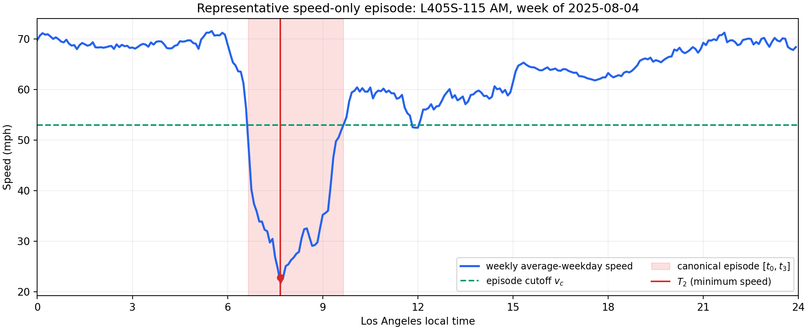

# I-405 FDQ Ground-Truth Dashboard

This repository contains the reproducible Stage-1 single-link benchmark used to build the I-405 FDQ dashboard.

Dashboard: https://jacky850.github.io/I405--FDQ-dashboard/

## Current primary validation: leakage-safe speed-only QVDF inversion

The current research question is whether an average-weekday speed profile can
recover period volume when the target data source provides **speed but no
flow**, as is expected for a future INRIX deployment. PeMS is used here because
it provides both speed and flow: flow is available for calibration weeks, is
completely hidden for the holdout week during inference, and is opened only
afterward to score the inferred volume.

This is a conditional estimator. It returns a volume only when a canonical
congestion episode is visible in speed and both independent support gates pass.
It abstains rather than fabricate a point estimate for free-flow or
out-of-calibration cases.

### Data source and declared scope

The source is the public TrafficFlowBench/PeMS I-405 South detector-state file:

```text
I405/S/train_detector_states.csv
```

The required source fields are `timestamp`, `station_id`, `link_id`, `speed`,
`flow`, `is_observed`, and `is_missing`. Only rows explicitly marked observed
and not missing are used. Detector speed is converted from km/h to mph; flow is
retained in veh/h. Multiple mapped stations on the same link and timestamp are
averaged to form a link observation. The source builder wrote a literal `Z`
without converting the clock to UTC, so these timestamps are deliberately
interpreted as Los Angeles local wall-clock time.

Seven I-405 South links are evaluated:

```text
L405S-012, L405S-018, L405S-028, L405S-030,
L405S-058, L405S-098, L405S-115
```

The raw date window is 2025-06-02 through 2025-08-29. 13 complete
Monday--Friday weeks are present. The week beginning 2025-06-30 is excluded by
a predeclared calendar rule because it contains Independence Day. The twelve
ordinary weeks used in leave-one-week-out validation begin on:

```text
2025-06-02, 2025-06-09, 2025-06-16, 2025-06-23,
2025-07-07, 2025-07-14, 2025-07-21, 2025-07-28,
2025-08-04, 2025-08-11, 2025-08-18, 2025-08-25
```

For each link and week, Monday--Friday observations are averaged by the same
5-minute LA-time bin, yielding one 288-bin average-weekday profile. AM is
06:00--10:00 and PM is 15:00--19:00. One validation case is therefore one
`link x period x holdout week` combination:

```text
7 links x 2 periods x 12 holdout weeks = 168 cases
```

### Leave-one-week-out design

There is no permanently designated test week. Each of the 12 weeks takes
one turn as the holdout week; the other 11 weeks are its training set. This
prevents a favorable week from being selected manually and gives every week an
out-of-sample prediction.

```text
11 training weekly profiles: speed + flow
    -> calibrate C, k_d, f_d, and f_p
    -> freeze C, k_d, f_d, f_p, n, and s

1 holdout weekly profile: speed only
    -> detect canonical episode and recover P, T2, v(T2), and v_c
    -> infer D/C and period volume V_hat
    -> apply speed-consistency gate
    -> apply duration-extrapolation gate

after inference is complete
    -> reveal holdout PeMS flow
    -> compare V_hat with observed period volume V_obs
```

Here `D` is the QVDF peak demand rate, `C` is capacity, and `P` is congestion
duration in hours; `D` must not be confused with duration. `T_p=4 h` for both
declared periods. The exponents are frozen to the mentor-model values
`n=1.10` and `s=1.40`.

For the eleven training weeks, the implementation estimates:

```text
C   = median weekly p95 observed flow
k_d = median[D / (V / T_p)]
x_i = D_i / C
f_d = median[P_i / x_i^n]       over training episode weeks
z_i = v_c,i / v(T2)_i - 1
f_p = median[z_i / P_i^s]       over training episode weeks
```

The holdout flow is not used in these estimates. From the holdout speed-only
episode, the duration branch computes:

```text
x_hat = (P / f_d)^(1/n)         where x_hat = inferred D/C
D_hat = C * x_hat
V_hat = T_p * D_hat / k_d
```

The held-out observed volume is calculated only for final scoring:

```text
APE  = abs(V_hat - V_obs) / V_obs x 100%
MAPE = mean(APE) across final supported cases
```

### Canonical speed episode

Episode identification uses only speed, persistence, and recovery. `t0` and
`t3` are the asymmetric episode boundaries, `T2` is the robust minimum-speed
time, `P=t3-t0`, and `v_c` is the recovery cutoff used by the severity branch.



### Gate 1: speed consistency

The frozen severity branch predicts the minimum speed:

```text
z_hat       = f_p P^s
v_hat(T2)   = v_c / (1 + z_hat)
z_observed  = v_c / v_observed(T2) - 1
```

The case passes only when both conditions hold:

```text
0.50 <= z_observed / z_hat <= 2.00
abs[v_hat(T2) - v_observed(T2)] <= 10 mph
```

This gate asks whether the calibrated QVDF severity branch can explain the
holdout week's observed speed minimum. It does not inspect holdout flow.

### Gate 2: duration extrapolation

A case may reproduce `v(T2)` while the duration branch extrapolates far beyond
the demand/capacity ratios observed during calibration. The second gate checks:

```text
duration extrapolation ratio
    = x_hat_holdout / max(x_observed_training_episode_weeks)
    <= 1.25
```

Thus the inferred holdout `D/C` may be at most 25% above the largest `D/C`
observed in that case's eleven-week training set. This gate also uses no
holdout flow. It rejects the three L405S-018 cases whose extrapolation ratios
are 2.09, 1.47, and 1.27. The 1.25 threshold is a transparent candidate chosen
after diagnosing this I-405 sample; it must be frozen and tested on independent
I-10 or INRIX-compatible data before being claimed as externally validated.

### Validation result

```text
168 total cases
|-- 137: no canonical congestion episode in speed
`--  31: canonical episode identified
     |-- 7: failed the speed-consistency gate
     |-- 3: failed the duration-extrapolation gate
     `-- 21: passed both gates and received a volume estimate
```

Final identified coverage is `21/168 = 12.50%`. Across those 21 supported
cases, volume MAPE is `16.51%` and median APE is `14.71%`. MAPE is conditional
on support: it does not imply that the method estimates volume for all 168
cases. Coverage and conditional error must always be reported together.

| Link-period | Supported cases | Coverage | Supported-case MAPE |
|---|---:|---:|---:|
| L405S-012 AM | 7/12 | 58.3% | 15.09% |
| L405S-018 AM | 1/12 | 8.3% | 37.71% |
| L405S-018 PM | 3/12 | 25.0% | 26.89% |
| L405S-115 AM | 10/12 | 83.3% | 12.28% |
| Other ten link-period groups | 0/120 | 0.0% | not identified |

#### Accuracy of every supported case

`Observed V` and `Inferred V` are average-weekday period totals in vehicles.

| Link | Period | Holdout week | Observed V | Inferred V | APE |
|---|---|---|---:|---:|---:|
| L405S-012 | AM | 2025-06-02 | 26,943 | 33,958 | 26.03% |
| L405S-012 | AM | 2025-06-09 | 27,383 | 22,833 | 16.62% |
| L405S-012 | AM | 2025-06-23 | 23,950 | 26,420 | 10.31% |
| L405S-012 | AM | 2025-07-14 | 25,815 | 22,018 | 14.71% |
| L405S-012 | AM | 2025-07-21 | 26,074 | 23,932 | 8.22% |
| L405S-012 | AM | 2025-08-18 | 23,160 | 28,069 | 21.19% |
| L405S-012 | AM | 2025-08-25 | 24,389 | 26,473 | 8.55% |
| L405S-018 | AM | 2025-08-11 | 46,701 | 29,088 | 37.71% |
| L405S-018 | PM | 2025-07-21 | 35,430 | 28,063 | 20.79% |
| L405S-018 | PM | 2025-08-11 | 37,121 | 45,652 | 22.98% |
| L405S-018 | PM | 2025-08-18 | 35,147 | 22,183 | 36.88% |
| L405S-115 | AM | 2025-06-02 | 22,934 | 23,320 | 1.68% |
| L405S-115 | AM | 2025-06-09 | 25,133 | 18,176 | 27.68% |
| L405S-115 | AM | 2025-06-23 | 25,049 | 22,355 | 10.76% |
| L405S-115 | AM | 2025-07-07 | 23,506 | 26,141 | 11.21% |
| L405S-115 | AM | 2025-07-14 | 23,834 | 25,398 | 6.56% |
| L405S-115 | AM | 2025-07-21 | 23,506 | 27,205 | 15.73% |
| L405S-115 | AM | 2025-07-28 | 24,712 | 21,233 | 14.08% |
| L405S-115 | AM | 2025-08-04 | 23,879 | 23,990 | 0.46% |
| L405S-115 | AM | 2025-08-11 | 24,696 | 19,255 | 22.03% |
| L405S-115 | AM | 2025-08-25 | 22,415 | 25,239 | 12.60% |

### Interpretation and current limitation

The validation protocol is leakage-safe and its abstention logic is explicit,
but the estimator is not yet a general I-405 solution. In free flow, many
different sub-capacity volumes can produce nearly the same speed. Therefore a
week with no canonical speed episode does not contain enough information for a
unique speed-only point estimate under the current duration inverse. Such a
case is labelled `not_identified_no_speed_episode`; it is not counted as a
zero-error prediction and no volume is fabricated.

The next research task is a separately validated free-flow branch, likely
using an interval estimate or a declared prior such as historical time-of-day,
Cube, or third-party volume. It must remain distinguishable from the pure
speed-only congested-episode result reported here.

### Reproduce and inspect

From the repository root:

```bash
python scripts/run_i405_multiweek_average_holdout.py
```

Principal outputs are:

```text
outputs/i405_multiweek_average_holdout/
|-- weekly_average_weekday_profiles_5min.csv
|-- weekly_data_completeness.csv
|-- weekly_canonical_states_and_ground_truth.csv
|-- leave_one_week_out_qvdf_results.csv
|-- leave_one_week_out_metrics.csv
|-- supported_case_accuracy.csv
|-- multiweek_holdout_summary.json
`-- figures/
    |-- representative_weekly_speed_episode.png
    |-- multiweek_holdout_volume_scatter.png
    `-- multiweek_coverage_matrix.png
```

The complete method note is in
[`docs/MULTIWEEK_AVERAGE_HOLDOUT_V1.md`](docs/MULTIWEEK_AVERAGE_HOLDOUT_V1.md).
