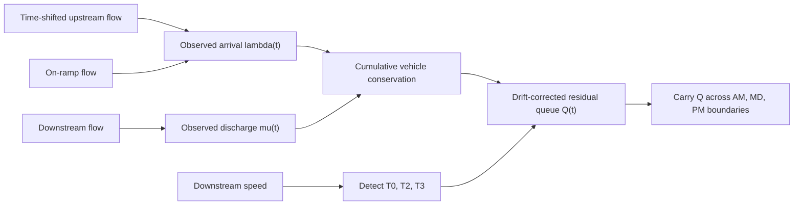

# I-405 Full-Day Single-Link Queue Reconstruction

This branch is a focused Stage-A prototype for recovering a **continuous
full-day residual queue** on one freeway link. It uses PeMS because PeMS
provides speed and flow at the same five-minute resolution: speed is used to
identify the congestion episode, while observed upstream, ramp, and downstream
flows provide the boundary counts for a conservation-based queue estimate.

The main design requirement is that the 24-hour state is continuous. AM, MD,
PM, NT1, and NT2 are labels for reporting only; they are not independent queue
simulations, and the queue is never reset merely because a period boundary is
crossed.

## Dashboards

- [PeMS queue continuity (public)](https://jacky850.github.io/I405--FDQ-dashboard/dashboard/full_day_residual_queue.html) · [source](dashboard/full_day_residual_queue.html)
- [NVTA speed-only queue continuity (public)](https://jacky850.github.io/I405--FDQ-dashboard/dashboard/nvta_full_day_queue.html) · [source](dashboard/nvta_full_day_queue.html)

The NVTA dashboard is the transfer case: one INRIX link, one full day, and no
flow measurement anywhere. See [NVTA speed-only case](#nvta-speed-only-case).

The dashboard is published through the repository's official GitHub Pages site
instead of a third-party raw-file preview. Local preview instructions are also
provided under [Reproduce the result](#reproduce-the-result).

The dashboard focuses on the main evidence: the full-day reporting-period
definition, the count-based residual queue from formation to dissipation, and
the observed speed episode with T0, T2, T3, and P. AM and MD use different
background colors. The 10:00 line shows the period handoff, where a nonzero
queue demonstrates that the state is carried into the next period.

## Current case

| Item | Value |
|---|---:|
| Date | 2025-07-29 |
| Time zone | America/Los_Angeles |
| Resolution | 5 minutes, 288 bins |
| Target/downstream link | L405S-004 |
| Upstream link | L405S-041 |
| Upstream mainline detector | 1201497 |
| On-ramp detector | 1201517 |
| Downstream detector | 1201525 |
| Segment length | 1.480596 km |

This is one **observed Tuesday**, not an average-weekday profile. A real day was
selected deliberately because the present task is to demonstrate whether a
physical queue can survive a reporting-period boundary. Average-weekday and
multi-day tests should be added after this single-day conservation test is
stable.

The repository contains a minimal reproducible PeMS input containing only the
three selected detectors for this date:

```text
data/pems_single_link_2025-07-29_L405S-004.csv.gz
```

Each detector has all 288 five-minute records. The input follows the original
PeMS station five-minute layout and includes timestamp, detector metadata,
five-minute flow, occupancy, speed, and percent observed. Flow is converted
from vehicles per five-minute bin to veh/h inside the script; speed is already
in mph.

## Computational pipeline



### 1. Build a single 24-hour clock

All three detector series must contain the same 288 timestamps. The upstream
mainline flow is shifted by the approximate free-flow travel time from the
upstream detector to the downstream detector. The observed arrival and service
rates are then

$$
\lambda_{\mathrm{obs}}(t)
=q_{\mathrm{upstream}}(t-\tau)+q_{\mathrm{ramp}}(t),
\qquad
\mu_{\mathrm{obs}}(t)=q_{\mathrm{downstream}}(t).
$$

For this test, the ramp has observed flow, so no ramp imputation is used.

### 2. Identify the congestion episode from speed

The downstream speed is smoothed with a centered three-bin median. The
free-flow reference is the 95th percentile of the full-day smoothed speed.
Congestion begins when speed falls below 70% of that reference and ends after
two consecutive bins at or above 75%. Episodes shorter than 20 minutes are
discarded.

For the selected day:

| Parameter | Result |
|---|---:|
| Free-flow speed | 70.465 mph |
| Entry threshold | 49.326 mph |
| Exit threshold | 52.849 mph |
| T0 | 07:25 LA time |
| T2, minimum-speed time | 09:55 LA time |
| T3 | 10:25 LA time |
| Congestion duration | 185 minutes |
| Minimum speed | 10.7 mph |

The episode is asymmetric: T2 is the observed minimum-speed bin and T0/T3 are
detected independently. No artificial symmetry around T2 is imposed.

### 3. Recover the count-based reference queue

Vehicle conservation is integrated across the entire day with
$\Delta t=5/60$ hours:

$$
C_{k+1}=C_k+
\left[\lambda_{\mathrm{obs}}(k)-\mu_{\mathrm{obs}}(k)\right]\Delta t.
$$

Upstream and downstream detectors can have a small persistent count mismatch.
If this detector drift is accumulated for many hours it can look like a large
queue even during free flow. To avoid that artifact, the implementation uses
one-hour free-flow windows before and after the detected episode, estimates a
linear baseline $B_k$ between their median cumulative-count levels, and defines

$$
Q_k^{\mathrm{count}}=\max\left(0,\ C_k-B_k\right).
$$

This correction removes only the measured linear detector drift. It does not
fit the shape or peak of the queue. Speed determines when an episode is active,
but AM/MD/PM boundaries do not reset $Q_k$.

### 4. Carry the residual queue across periods

The queue recurrence is one continuous state equation:

$$
Q_{k+1}=\max(0,\;Q_k+(\lambda_k-y_k)\Delta t).
$$

where the realized outflow is bounded by available vehicles and service rate:

$$
y_k=\min(\mu_k,\;\lambda_k+Q_k/\Delta t).
$$

At 10:00, the reporting label changes from AM to MD, but the count-based queue
is still **255.44 vehicles**. The queue reaches **354.14 vehicles** at 09:00 and
is cleared only after the speed-recovery gate, not at the period boundary.

## What is checked with PeMS

PeMS makes this case especially useful because the model does not need to
pretend that speed alone determines flow. PeMS provides observed speed and flow
for three implementation and consistency checks.

### A. Detector coverage and topology check

The median percent-observed value is 100% for the upstream, ramp, and downstream
detectors. The arrival boundary contains the upstream mainline plus the on-ramp;
the discharge boundary is the downstream mainline detector. Omitting the ramp
would violate conservation for this segment.

### B. Vehicle-conservation and period-continuity check

The primary queue is calculated directly from observed arrival and discharge
counts. The recurrence uses the previous five-minute state throughout the full
day. Its maximum is 354.14 vehicles and its value at the AM-to-MD boundary is
255.44 vehicles, confirming that the implementation does not reset the state
when the reporting label changes.

### C. Speed-implied diagnostic comparison

The CSV also retains an experimental speed-delay queue:

$$
Q_k^{\mathrm{speed}}
=\mu_k\max\left(0,
\frac{L}{v_k}-\frac{L}{v_k^{\mathrm{baseline}}}
\right).
$$

This branch produces a maximum of 404.54 vehicles. During the episode its MAE
against the count-based queue is 81.72 vehicles, correlation is 0.485, and the
two peak times differ by 60 minutes. These values show that speed captures the
broad buildup and dissipation pattern but does **not** yet recover the physical
queue estimate accurately enough to replace observed counts.

The very small forward-closure error and the 0.176 mph congested reconstructed-
speed MAE are algebraic consistency checks: the same speed-delay relationship
is inverted and then run forward. They confirm that the recurrence is coded
consistently, but they are not independent evidence that the inferred queue is
correct.

## Queue accuracy is not yet validated

PeMS provides ground-truth **speed and detector flow**, but it does not directly
observe the number of queued vehicles on the segment. Therefore this experiment
does not prove that the maximum queue is exactly 354.14 vehicles or that every
five-minute value of $Q(t)$ equals the physical queue.

The current result should be described as a **flow-conservation-based queue
estimate/reference**, not an observed queue ground truth. Its numerical values
are conditional on the selected detector topology, upstream travel-time shift,
ramp inclusion, detector-drift correction, and initial queue assumption. The
near-zero recurrence closure error verifies implementation consistency only;
it is expected when the same $\lambda(t)$ and $\mu(t)$ are placed back into the
same conservation equation.

Future queue validation should triangulate the estimate using the following
three approaches:

1. **Multi-detector time-space analysis.** Build a corridor time-space speed
   map, identify the upstream and downstream queue boundaries and shockwave
   movement, and compare the resulting queue duration and spatial extent with
   the single-link estimate.
2. **Occupancy, queue length, and jam density.** Estimate spatial queue length
   from detector occupancy and convert that length into queued vehicles using a
   defensible jam-density assumption.
3. **Method cross-validation.** Run an established CTM, LWR, or PAQ queue
   estimation method on the same detector boundaries and compare queue onset,
   dissipation, peak time, and magnitude.

Until one or more of these checks are completed, the dashboard demonstrates
vehicle conservation and cross-period state continuity, not independently
validated queue accuracy.

## Why the speed-implied branch is difficult

Several limitations matter before this method can be transferred to speed-only
data:

1. **Flow is not uniquely identifiable from free-flow speed.** Many demand
   levels can produce nearly the same high speed, so a free-flow link needs a
   prior, assignment volume, or an abstention rule.
2. **Delay is not identical to the number of queued vehicles.** The simple
   $\mu\Delta TT$ expression compresses spatial queue propagation and detector
   location effects into one point-queue approximation.
3. **Detector drift accumulates.** A small persistent difference between
   upstream and downstream counts can create a false queue unless conservation
   is corrected using free-flow baselines.
4. **Boundary topology matters.** On-ramps, off-ramps, HOV/HOT lanes, and
   unmatched detector coverage must be included or explicitly modeled.
5. **Travel-time alignment matters.** Upstream flow must be shifted before it
   is compared with downstream discharge.
6. **Inverse/forward reconstruction can be circular.** Reconstructing speed
   with parameters derived from that same speed is a closure check, not a true
   holdout validation.

## Expected adaptation for NVTA / INRIX

NVTA/INRIX is expected to provide time-dependent speed but not the same
upstream, ramp, and downstream flow measurements. Therefore the count-based
PeMS reference cannot be used directly in deployment. The recommended transfer
path is:

1. Expand this PeMS experiment across many links, days, link types, and queue
   shapes.
2. Calibrate a speed-to-queue/service model against the PeMS count-based
   reference, using leakage-safe holdout links or dates.
3. Freeze the calibrated parameters and episode rules before applying them to
   INRIX speed.
4. Supply $\mu(t)$ from calibrated capacity/QVDF parameters or trusted network
   attributes; infer a smooth $\lambda(t)$ under the full-day conservation
   constraints.
5. Add a separate free-flow branch using a historical time-of-day or Cube/QVDF
   volume prior. If no defensible prior exists, return an interval or abstain
   rather than claim a unique flow.
6. Audit link matching before inference, especially general-purpose versus
   HOV/HOT/APV links, ramps, direction, and link length.
7. Validate corridor-level propagation only after the single-link PeMS holdout
   tests are stable.

In short, PeMS supplies observed speed and flow for building the conservation
reference and testing future mappings; INRIX deployment will use the frozen
mapping plus network priors, not hidden INRIX flow.

## Reproduce the result

From the repository root, run:

```powershell
python scripts/run_pems_full_day_single_link.py `
  --raw-file data/pems_single_link_2025-07-29_L405S-004.csv.gz `
  --output-dir outputs/pems_full_day_residual_queue_2025-07-29_L405S-004

python scripts/build_full_day_residual_dashboard_data.py `
  --input-dir outputs/pems_full_day_residual_queue_2025-07-29_L405S-004 `
  --output dashboard/full_day_residual_data.js

python -m http.server 8772
```

Then open:

```text
http://127.0.0.1:8772/dashboard/full_day_residual_queue.html
```

Required Python packages are `numpy` and `pandas`. The dashboard itself is
self-contained static HTML/CSS/JavaScript and draws the charts as inline SVG.

## Files to continue from

| File | Purpose |
|---|---|
| `scripts/run_pems_full_day_single_link.py` | Main 24-hour episode, conservation, queue, and consistency-check pipeline |
| `data/pems_single_link_2025-07-29_L405S-004.csv.gz` | Minimal reproducible three-detector PeMS input |
| `outputs/pems_full_day_residual_queue_2025-07-29_L405S-004/full_day_timeseries_5min.csv` | Complete 288-bin output with speed, flow, lambda, mu, queue, and diagnostics |
| `outputs/pems_full_day_residual_queue_2025-07-29_L405S-004/congestion_episodes.csv` | T0, T2, T3, duration, queue peaks, and comparison metrics |
| `outputs/pems_full_day_residual_queue_2025-07-29_L405S-004/summary.json` | Machine-readable case summary and boundary states |
| `scripts/build_full_day_residual_dashboard_data.py` | Converts the CSV/JSON outputs into static dashboard data |
| `dashboard/full_day_residual_queue.html` | Dashboard entry point |

## Scope and next step

This branch demonstrates the full-day state logic for **one PeMS link and one
day**. It does not yet claim a validated physical queue, an all-link model, or
an NVTA-ready speed-only estimator. The next scientific step is to repeat the
conservation-based estimate on multiple PeMS links/days, apply the three queue
validation approaches above, estimate how error changes with topology and
episode shape, and then design the calibrated speed-only NVTA branch.

## NVTA speed-only case

The PeMS case counts the queue at both boundaries. NVTA/INRIX has **no flow
measurement anywhere**, so the arrival and discharge boundaries are both
inferred and the PeMS pipeline does not transfer directly. The NVTA case is
therefore built and reported differently.

| Item | Value |
|---|---|
| Link | TMC `110-04178`, network link `31800`, I-66 EB, Fairfax County |
| Geometry | 1.045 mi, 4 lanes |
| Day | 2025-10-08, 288 five-minute bins, zero missing |
| Clock | continuous minutes 360–1800 (06:00 to 06:00 next morning), no midnight reset |
| Periods | AM 360–540, MD 540–900, PM 900–1140, NT 1140–1800 |

Two arrival branches are carried side by side:

- **Branch B** parameterises `lambda(t)` as a cubic B-spline in time of day and
  produces `Q(t)` **only** from the recurrence, so the state always carries
  `Q(t-1)`. The speed-implied queue is the fitting target rather than the queue
  itself, which turns the residual into a real measure of how much of the
  observed speed a physically smooth arrival process explains.
- **Branch A** takes `lambda(t)` from the week-average QVDF calibration and
  never looks at the day's speed. Because that demand is an S3 inversion of
  speed it returns served flow and is capped at capacity by construction, so
  Branch A is run as a capacity sweep and reported as a falsification test.

### Result

```text
Peak queue            272 veh   [251-343 over 36 assumption combinations]
Peak time             08:05     [07:50-08:05]
Q at 09:00 AM->MD     198 veh   [181-250]
Q at 15:00 MD->PM     197 veh   [166-225]
Q at 19:00 PM->NT       0 veh
Model residual RMSE  22.4 veh   vs the speed-implied queue
Gates                 4 pass, 1 fail, 2 not testable
```

The PM episode begins at 14:20, inside MD, so a period-by-period run would
start PM from zero and lose that queue entirely.

`G7 cross-method agreement` fails: over the capacity sweep the Branch A peak
spans 0 to 35,548 vehicles against a link storage of 836, and only one assumed
capacity is physically admissible. `G4 occupancy` and `G5 boundary flow
quality` are **not testable** on NVTA — there is no occupancy series and no
flow measurement at any boundary.

This is not an accuracy validation. Both boundaries are inferred, so the
reported range reflects assumption spread, not measurement error.

### Reproduce

```bash
python scripts/prepare_nvta_full_day_link.py --speed-file <i66eb_raw_5min.csv> --mapping-file <corridor_tmc_mapping.csv> --qvdf-file <observed_t2_dataset_week_2025-10-06_to_10.csv> --data-dir data/nvta_i66eb_31800_2025-10-08 --output-dir outputs/nvta_full_day_single_link_2025-10-08_31800
```

```bash
python scripts/run_nvta_full_day_queue.py --data-dir data/nvta_i66eb_31800_2025-10-08 --output-dir outputs/nvta_full_day_single_link_2025-10-08_31800 --mu-config configs/nvta_mu_prior.json
```

```bash
python scripts/run_nvta_full_day_gates.py --data-dir data/nvta_i66eb_31800_2025-10-08 --output-dir outputs/nvta_full_day_single_link_2025-10-08_31800 --mu-config configs/nvta_mu_prior.json
```

```bash
python scripts/build_nvta_full_day_dashboard_data.py --input-dir outputs/nvta_full_day_single_link_2025-10-08_31800 --data-dir data/nvta_i66eb_31800_2025-10-08 --output dashboard/nvta_full_day_data.js
```

`configs/nvta_mu_prior.json` is the replaceable service-rate input. NVTA has no
observed discharge, so the capacity is an HCM assumption carrying its own
provenance; swapping in a corrected calibration needs no code change. The PeMS
per-lane values are recorded there but deliberately **not** used as input,
because 14 of 35 PeMS link-periods fail a per-lane plausibility gate.

Branch B requires `scipy` in addition to `numpy` and `pandas`.
