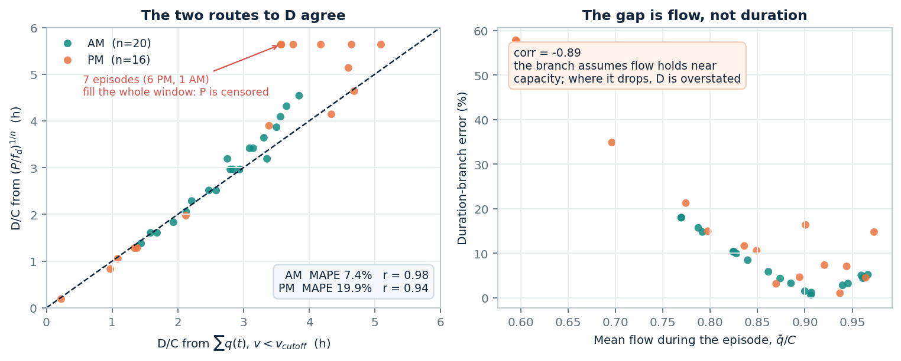
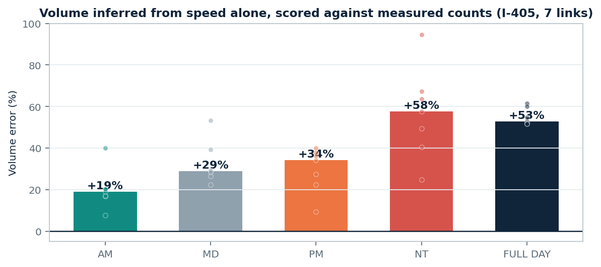

# I-395 NB: inferred demand D and volume V per period

**What I ran, what came out, and the one input I still need.**

---

## 0. Correction to the earlier version of this note

An earlier version of this page argued that the inferred D/C of 3–4 was
unphysical. That was my error, and it was a unit error: I read D/C as a ratio of
**flow rates** and multiplied it by an hourly capacity, which turned a period
volume into an implied 8,500 veh/h.

Your assignment table settles the convention. Taking the ratio of its two D/C
columns across 208 rows:

| Period | `dc_dta_vol` ÷ `dc_dta_doc` | Period length |
|---|---:|---:|
| AM | 3.000014 | 3 h |
| MD | 5.999623 | 6 h |
| PM | 4.000017 | 4 h |

The ratio is the period length in hours, to four decimals. So D/C is a **period
volume divided by an hourly capacity**, it carries units of hours, and 3–4 is
ordinary. Everything below is redone on that basis, and the accumulation
argument from the earlier version is withdrawn: it assumed D was a sustained
rate, so the quantity it tested does not exist.

## 1. Method

Built forward from q(t) as you asked, not by inverting the duration branch:

$$D_{\text{period}} = \sum_{t\,:\,v(t) < v_{\text{cutoff}}} q(t)
\qquad\qquad
V_{\text{period}} = \sum_{t \in \text{period}} q(t)$$

both in vehicles. `data_private/nvta/qvdf/` contains only `NVTA_NB`, so this is
**I-395 NB only**: 23 links, 10.84 mi, average weekday 2025-10-06 to 10-10,
15-minute bins, 92 link-periods of which 51 carry an episode below the 49 mph
cutoff. Capacity 2,200 vph/lane and free speed 70 mph are your constants.

## 2. Result

| Period | Congested links | P median | **D** median (veh) | D/C median (h) | **V** median (veh) |
|---|---:|---:|---:|---:|---:|
| AM (5 h) | 20 / 23 | 3.25 h | 6,204 | 2.82 | 9,895 |
| MD (4 h) | 9 / 23 | 4.00 h | 7,635 | 3.47 | 8,284 |
| PM (6 h) | 16 / 23 | 4.75 h | 7,861 | 3.57 | 12,346 |
| NT (2 h) | 6 / 23 | 2.00 h | 4,098 | 1.86 | 4,141 |

Per-link values are in `outputs/nvta_corridor_dv_forward_i395nb/corridor_dv_forward.csv`.

## 3. This agrees with your duration branch



Inverting $P = f_d (D/C)^n$ with your `f_d` and `n` reproduces the forward sum to
**7.4% in AM** (r = 0.98) and **19.9% in PM** (r = 0.94).

The PM gap has a cause rather than being noise. Writing the forward sum as
$D/C = \bar q / C \times P$, the branch is equivalent to assuming $\bar q / C$ is
fixed across links. It is not: it runs 0.77–0.97 in AM but 0.59–0.97 in PM,
because the worst links drop well below capacity while queued. The error tracks
that ratio directly, $\mathrm{corr} = -0.89$ — where flow holds up the branch is
accurate, where flow collapses the branch overstates D. Seven episodes are also
right-censored, filling their whole period window, so their P is a lower bound.

## 4. The problem is V, not D

D only sums bins below the cutoff. There the congested branch of the fundamental
diagram is steep and single-valued, so recovering q from v is well posed, and I
am confident in the D column.

V sums the free-flow bins as well, and there the inversion has nothing to work
with. `count_total_15min` in the handoff is not an independent measurement: it
reproduces an S3 evaluation of its own `speed_smoothed` to **3.3%** (R² = 0.94).


**Left** is measured I-405 detector data. At 65 mph the road carries anywhere
from 4% to 100% of that link's daily peak flow, because free-flow speed barely
responds to volume — 65 mph at 03:00 and 65 mph at 06:30 are entirely different
traffic. **Right** is the handoff series, which at free-flow speeds spans only
1.5× and traces a single curve. Its daily mean-to-peak ratio is 0.94 against
0.57 for measured I-405, i.e. it has the corridor running at 91% of capacity for
17 straight hours, with no diurnal profile at all.

So V here is not a volume, it is a fundamental diagram read backwards. To size
the consequence I ran the same speed-only inversion on the I-405 links where
real counts exist and scored it against them:



| | AM | MD | PM | NT | Full day |
|---|---:|---:|---:|---:|---:|
| Volume error | +19% | +29% | +34% | +58% | +53% |

One-sided overstatement, growing as congestion recedes. **The V column should be
read as an upper bound**, which matters because V is the column that goes
against the Cube and TAP-Lite assignment.

## 5. What I need

1. **Any flow measurement for these corridors.** Detector counts, INRIX volumes,
   or even an AADT per link I can use to scale the profile. Speed alone cannot
   produce V, and no choice of parameters changes that — the information is not
   in the input.
2. **Which period clock should V be cut on?** The handoff uses AM 5 h / MD 4 h /
   PM 6 h / NT 2 h, but `dc_dta_vol / dc_dta_doc` implies AM 3 h / MD 6 h /
   PM 4 h. These have to match before V is compared to the assignment.
3. **Is there anything for I-395 SB and I-66?** Only `NVTA_NB` is in the repo.
   If not, I can transfer the NB parameters and label the transfer, though `s`
   differs by 2.9× and `f_p` by 8× between AM and PM on this one corridor, so I
   would rather ask.

On (1), note that D is affected too, just far less: it is *served* volume during
congestion, capped at capacity in every bin, so it is what the corridor
discharged rather than what wanted to use it. For a bottleneck link those differ.

---

## Reproduce

```powershell
python scripts/run_nvta_corridor_dv_forward.py
python scripts/check_qt_information_content.py
python scripts/make_dv_note_figures.py
```
