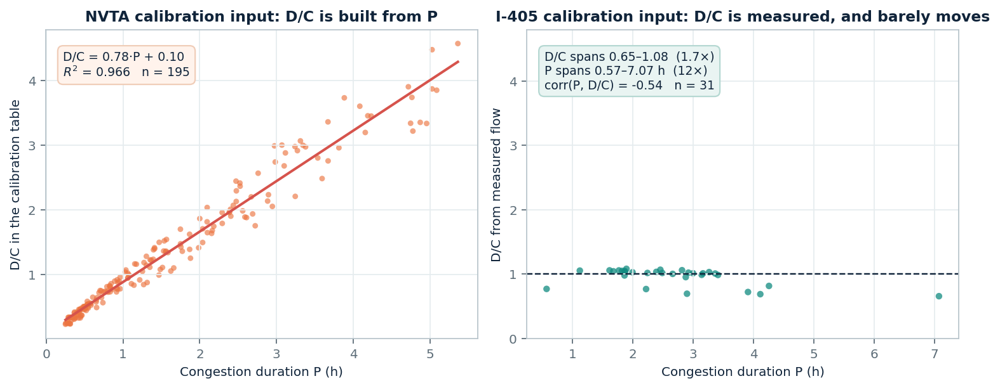
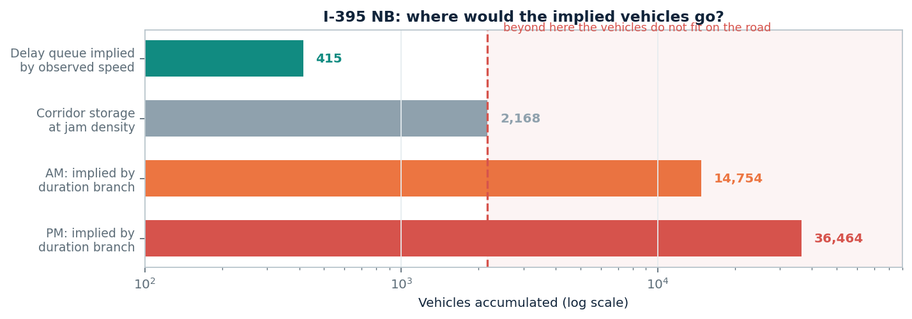
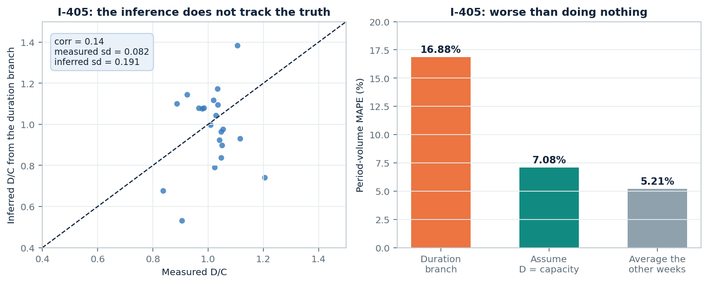

# The QVDF duration branch cannot be identified from either dataset

**I-395 NB inferred demand and volume — what I ran, what came out, and what I need.**

Interactive results: [I-395 NB corridor dashboard](https://jacky850.github.io/I405--FDQ-dashboard/dashboard/nvta_corridor_d_v.html)

---

## 1. What I could run

`data_private/nvta/qvdf/` contains only `NVTA_NB`. There is no `NVTA_SB` and
nothing for I-66, so this covers **I-395 NB only**: 23 links, 36 link-periods
with a congestion episode, average weekday 2025-10-06 to 10-10.

I used your conventions throughout rather than the I-405 ones, because your
`f_d` and `n` were fitted against them:

| | Value used |
|---|---|
| Episode | contiguous span below the 49 mph cutoff |
| Periods | your clock: AM 05:00–10:00, PM 14:00–20:00 |
| `n`, `s` | your file: 1.0101 / 3.3773 (AM), 0.9351 / 1.1484 (PM) |
| Capacity, free speed | your constants: 2200 vph/lane, 70 mph |

## 2. The result is not usable

Inverting the duration branch

$$P = f_d\left(\frac{D}{C}\right)^{n}
\qquad\Longrightarrow\qquad
\widehat{\frac{D}{C}} = \left(\frac{P}{f_d}\right)^{1/n}$$

gives a median **D/C of 2.96 in AM and 4.39 in PM** — demand at three to four
times capacity, sustained for hours. Link 1 in AM: P = 4.25 h gives D/C = 3.86
and D = 8,503 veh/h on a lane whose capacity is 2,200.

## 3. Why it happens: the calibration input



**Left — the NVTA calibration table.** D/C there is a linear rescaling of P:

$$\frac{D}{C} = 0.78\,P + 0.10, \qquad R^2 = 0.966, \qquad n = 195 \text{ link-periods}$$

Fitting $P = f_d (D/C)^n$ on that data is fitting $P$ against itself. Substituting,

$$P = f_d\,(0.78\,P)^{n}$$

which is satisfied by $n = 1$ and a matching constant — and that is what the
file contains, $n = 1.0101$ in AM and $0.9351$ in PM. I reproduced it: feeding
synthetic D/C generated from P through the same fit returns $n = 1.05$,
$f_d = 1.16$, $R^2 = 0.9998$.

With $n \approx 1$ the inversion collapses:

$$\widehat{\frac{D}{C}} \approx \frac{P}{f_d}, \qquad \mathrm{corr}\left(\widehat{x},\ P/f_d\right) = 0.9926$$

**So the quantity I am reporting as D/C is congestion duration in hours, divided
by 1.08 and relabelled as a ratio.** A 4.25-hour episode gives 3.86 for that
reason alone.

**Right — my I-405 calibration input**, where D/C comes from measured flow
rather than from P. It fails for the opposite reason: D/C spans 0.65–1.08 while
P spans 0.57–7.07 hours. A quantity that moves 1.7× cannot explain one that
moves 12×. Fitting `n` freely there gives $R^2 = 0.119$ and per-link values
between $+1.4$ and $-11.2$.

**Neither dataset identifies the branch.** One has no independent D/C, the other
has one that barely varies.

## 4. A check that uses no model

Demand held at $D$ for duration $P$ must deposit vehicles somewhere:

$$\text{accumulation} = (D - \mu)\,P$$

This is conservation only — no fundamental diagram, no power law, no calibration.



| | Vehicles |
|---|---:|
| Delay queue implied by the observed speeds, peak | 415 |
| Corridor storage at jam density (10.84 mi, 200 veh/mi/ln) | 2,168 |
| Implied by the duration branch, AM | **14,754** |
| Implied by the duration branch, PM | **36,464** |

The implied accumulation exceeds what the road can physically hold by **6.8×**
in AM and **16.8×** in PM.

This does not depend on the service rate assumption. Varying $\mu$ from 1,980
(capacity with a 10% drop) to 2,400 (the HCM ceiling) leaves the AM ratio
between 6.2× and 6.8×. To make the accumulation fit, $\mu$ would have to be
**5,853 veh/h/lane**, 2.7× physical capacity.

## 5. The same test on I-405

I applied the branch to my own data, where D and C come from measured flow.



**Left.** The inferred D/C does not track the measured one: correlation 0.14.
The inference varies 2.3× more than the truth does (sd 0.191 against 0.082), so
it is adding scatter rather than resolving anything.

**Right.** Leave-one-week-out period volume, 21 supported cases:

| Method | MAPE |
|---|---:|
| Duration branch | 16.88% |
| Assume $D = C$, ignore P entirely | **7.08%** |
| Average the other weeks, ignore speed entirely | **5.21%** |

**The branch is 2.4× worse than assuming demand equals capacity.** The error
decomposes cleanly: cases where $\widehat{x}$ lands near 1 carry 8.0% error,
cases where it strays carry 25.8%, and
$\mathrm{corr}(|\widehat{x}-1|,\ \text{error}) = 0.814$.

The reason the I-405 numbers stay near capacity rather than reaching 4× is that
the calibration there is not circular, so $f_d$ lands near the median $P$ and
anchors $\widehat{x}$ near 1. The anchor, not the branch, is doing the work.

## 6. What does work

Your **severity branch** behaves well on the same episodes: predicted $v(T_2)$
is within **2.88 mph** in AM (7.00 mph in PM). The problem looks specific to the
duration branch.

A **conservation estimate** on the same speed data,

$$D = \mu + \frac{\mathrm{d}Q}{\mathrm{d}t}, \qquad Q = \mu\left(\frac{L}{v} - \frac{L}{v_f}\right)$$

gives corridor D/C of 0.99 in AM and 0.94 in PM. I am not offering this as
ground truth — it is anchored on an assumed capacity, and per link it degenerates
entirely, because on a 0.34-mile link the delay queue holds ~15 vehicles and
$\mathrm{d}Q/\mathrm{d}t$ is 0.5% of $\mu$, so $D$ simply returns $\mu$. Only
the corridor aggregate carries signal, where $\mathrm{d}Q/\mathrm{d}t$ reaches
15% of $\mu$.

Three routes land near 1.0 — measured I-405 upstream-plus-ramp counts at 1.05,
this corridor's conservation estimate at 0.94–0.99, and the peak of your own
speed-derived flow at 0.97 — against 2.96 and 4.39 from the duration branch.

## 7. What I need

1. **Do calibrated parameters exist for I-395 SB and I-66?** Only `NVTA_NB` is in
   the repo. If not, should I transfer the NB parameters and label the transfer?
   Given that `s` differs by 2.9× and `f_p` by 8× between AM and PM on a single
   corridor, I would rather ask than assume.
2. **For the NVTA meeting, which column do you want?** D and V from your
   parameters as delivered, and the conservation estimate, are both in the
   dashboard. I have not substituted one for the other.
3. **Is there a demand measurement for these corridors that is not capped at
   capacity** — ramp counts, ODME output, anything upstream of a bottleneck?
   That is the missing input. Detector flow at the link is throughput, which
   saturates at capacity, which is why my I-405 D/C sits at 1.0 with sd 0.08 and
   cannot identify the branch either.

One observation on (3): to land D/C near 1.1, `n` would need to be around 13
rather than 1.01. A large `n` is what queueing behaviour would suggest, since
delay grows sharply as D/C approaches 1. `n ≈ 1` states that duration grows
linearly with demand, which is a different physical claim.

---

## Reproduce

```powershell
python scripts/run_nvta_corridor_d_v.py `
  --profile-file data/nvta_i395nb_handoff/handoff_avgweekday_timedependent.csv `
  --params-file  data/nvta_i395nb_handoff/handoff_link_qvdf_params.csv

python scripts/run_nvta_corridor_queue_demand.py `
  --profile-file data/nvta_i395nb_handoff/handoff_avgweekday_timedependent.csv

python scripts/make_duration_branch_figures.py
```

## A caveat on the handoff counts

`count_total_15min` in `handoff_avgweekday_timedependent.csv` is not an
independent measurement. Across 1,564 bins it is a single-valued unimodal
function of speed peaking at the cutoff, no bin exceeds capacity (max 99.64% of
it), an S3 inversion reproduces it to 2.73%, and every link reports one lane. I
have treated it as speed-derived throughout, so nothing in this note is a
validation against counts.
