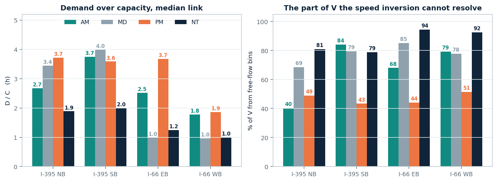
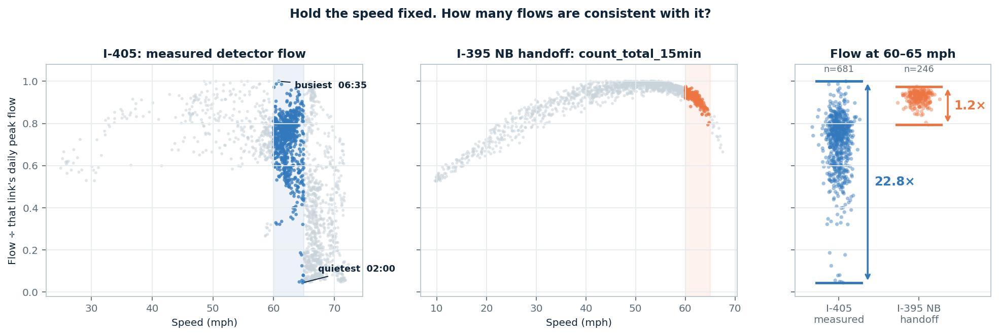
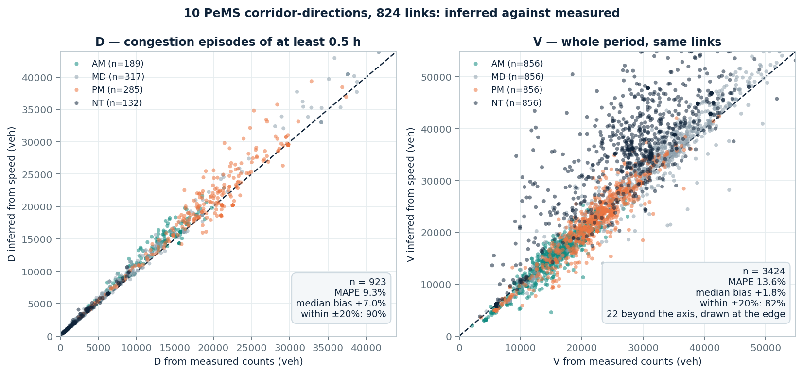

# D and V for four NVTA corridors

I-395 NB, I-395 SB, I-66 EB, I-66 WB — **104 TMCs, 61.6 miles**, average weekday
2025-10-06 to 10-10, 15-minute bins.

Built from RITIS speed plus `corridor_tmc_mapping.csv` and the constants in
`qvdf_selfdemo/config.py`. **No calibrated QVDF parameter is used** — D is
summed forward, not inverted out of the duration branch.

---

## How D and V are computed

**1. Flow from speed.** The S3 fundamental diagram, inverted onto the congested
branch, with `m = 4` so that `v_c = v_f/√2` = 49.5 mph at `v_f` = 70:

$$k(v) = k_c\left[\left(\frac{v_f}{v}\right)^{m/2} - 1\right]^{1/m}, \qquad q(t) = k\big(v(t)\big)\cdot v(t)$$

**2. Sum it.** D over the congested bins, V over the whole period:

$$D = \sum_{t\,:\,v(t)\,\lt\,v_{\text{cutoff}}} q(t)\,\Delta t \qquad\qquad V = \sum_{t \in \text{period}} q(t)\,\Delta t$$

Both in **vehicles**, with `v_cutoff = 0.70·v_f` = 49 mph and `Δt` = 15 min.

**3. Ratio.** D/C divides a period volume by an *hourly* capacity, so it carries
units of hours:

$$\frac{D}{C} = \frac{\bar q}{C}\times P$$

where P is the time below the cut-off. Values of 3–4 are ordinary.

## Results

Median link, on the pipeline clock (AM 5 h, MD 4 h, PM 6 h, NT 2 h).

| Corridor | Period | Congested | P median | **D/C** | **D** (veh/lane) | **V** (veh/lane) |
|---|---|---:|---:|---:|---:|---:|
| **I-395 NB** | AM | **20/20** | 3.00 h | 2.67 | 5,881 | 10,113 |
| (20 TMCs, 9.25 mi) | MD | 9/20 | 4.00 h | 3.44 | 7,576 | 8,487 |
| | PM | 16/20 | 5.38 h | 3.72 | 8,178 | 12,665 |
| | NT | 5/20 | 2.00 h | 1.89 | 4,150 | 4,177 |
| **I-395 SB** | AM | 5/21 | 3.75 h | 3.74 | 8,237 | 10,180 |
| (21 TMCs, 9.94 mi) | MD | 4/21 | 4.00 h | 3.99 | 8,771 | 8,416 |
| | PM | **19/21** | 3.75 h | 3.59 | 7,888 | 12,806 |
| | NT | 5/21 | 2.00 h | 1.99 | 4,387 | 4,202 |
| **I-66 EB** | AM | 24/36 | 2.75 h | 2.51 | 5,528 | 9,862 |
| (36 TMCs, 22.29 mi) | MD | 19/36 | 1.00 h | 0.99 | 2,173 | 8,290 |
| | PM | 31/36 | 3.75 h | 3.68 | 8,088 | 12,345 |
| | NT | 5/36 | 1.25 h | 1.25 | 2,748 | 3,943 |
| **I-66 WB** | AM | 14/27 | 2.00 h | 1.77 | 3,899 | 9,793 |
| (27 TMCs, 20.13 mi) | MD | 18/27 | 1.00 h | 0.97 | 2,131 | 8,484 |
| | PM | **27/27** | 2.00 h | 1.86 | 4,083 | 12,219 |
| | NT | 4/27 | 1.00 h | 1.00 | 2,199 | 4,020 |



Per-TMC values, link totals, and the same table on the **assignment clock**
(AM 3 h / MD 6 h / PM 4 h / NT 11 h) are in
`outputs/nvta_corridors_dv_ritis/corridor_dv_by_tmc.csv`.

**Two checks.** Rebuilding I-395 NB from RITIS reproduces the handoff-derived
D/C to −5.2% / −0.8% / +4.0% / +1.3% across the four periods, on a different
link definition. And the directional pattern is right: NB is 20/20 congested in
AM, SB is 19/21 in PM; on I-66 the AM queue sits 20–40 mi out on EB while the PM
queue is corridor-wide on WB.

## D is solid. V carries a much wider error band.

Both come from the same q(t), but the inversion behaves differently on the two
branches of the fundamental diagram.

**Below the cut-off** the congested branch is steep and single-valued. Speed is
*set by* density there — spacing dictates how fast you can go — so
`v → k → q` is a real physical chain. D rests on that.

**Above the cut-off** it breaks. Drivers pick their own speed largely regardless
of how many others are on the road, so one speed is consistent with a wide band
of flows: 65 mph at 03:00 and 65 mph at 06:30 are completely different traffic.
The diagram returns one answer anyway.



*Hold the speed at 60–65 mph and ask what flow was measured. On I-405 the answer
spans 23×, from 4% to 100% of that link's daily peak — the same speed is 06:35
traffic and 02:00 traffic. In the NVTA series it spans 1.2×, because there q(t)
is the diagram evaluated at the observed speed rather than a measurement.*

Scored against measured counts on **ten PeMS corridor-directions, 824 links** —
four freeways across two Caltrans districts, both directions each: I-405 in D7
(96 / 109 links) and again in D12 (50 / 44), I-5 in D12 (93 / 100), I-10 in D7
(101 / 107), I-210 in D7 (75 / 81). The two I-405 entries are different stretches
of the same freeway, not a duplicate.

Profiles are the weekday average of **194 weekdays spanning 39 weeks**,
2025-06-01 to 2026-02-28, taking `is_observed` rows only so nothing imputed
enters a comparison against measurement. S3 with the standard exponent `m = 4`.

| Period | **D** n | **D** MAPE | **D** bias | **V** n | **V** MAPE | **V** bias |
|---|---:|---:|---:|---:|---:|---:|
| **AM** | 189 | **10.0%** | +7.4% | 856 | **9.5%** | −4.9% |
| **MD** | 317 | **8.6%** | +7.3% | 856 | **7.6%** | +1.7% |
| **PM** | 285 | **8.8%** | +5.6% | 856 | **8.2%** | +1.0% |
| **NT** | 132 | **10.9%** | +8.4% | 856 | **29.0%** | +16.4% |



One observation is one link-period. **V is scored on every link-period; D only on
those holding a congestion episode of at least half an hour** — the
`MIN_EPISODE_H` rule in `config.py`, which matters because a brief dip is not
congestion and the diagram reads any low speed as high density however few
vehicles are behind it. That is why D's sample varies and V's does not. Errors
are `(inferred − measured) / measured` per observation; MAPE is the mean of the
absolute values, **bias is the median**, taken rather than the mean so a single
extreme case cannot set it.

**D holds between 8.6% and 10.9% across all four periods**, 90% of cases within
±20%. It leans consistently high, by 5.6–8.4%, and `|bias|` is 63–84% of MAPE —
so most of D's error is a correctable direction rather than scatter.

**V is 7.6–9.5% through AM, MD and PM and breaks down only at night** (29.0%,
+16.4%). In MD and PM its bias is 1–2% and `|bias|` is only 12–23% of MAPE, so
there the error really is scatter. Night is the exception in both size and
direction, which is where the free-flow problem should show: **40–94% of V comes
from free-flow bins** depending on corridor and period, and NT is the period made
almost entirely of them.

I would not call V a bound. It is close to unbiased against counts in daylight
and simply imprecise. It does read high against the DTA assignment — 1.09–1.15×
where congestion is heaviest, 1.3–1.9× where lighter — but neither series is
ground truth there, so that gap is an open question rather than a correction.

**A caveat on all of the above.** These are average-weekday profiles, so both the
speed and the counts are smoothed across many days. That is the same construction
the NVTA deliverable uses, which makes it the right comparison — but it describes
accuracy on an average weekday, not on any individual day. An earlier version of
this note reported 14.2% for D and 16–19% for V from a single corridor of 23
links; the numbers above supersede those, and the difference is mostly sample
size and cleanliness rather than method.

**On the earlier PM gap.** A previous version of this table had only 4 PM
episodes and a 45.1% PM error for D. The cause was direction, not method: every
link then available was I-405 southbound, the local AM commute, whose PM median
speed is 66–72 mph. There was no PM congestion there to score. With both
directions of four corridors, PM has 285 episodes and lands at 8.8%.

## The question

**Is there any vehicle count on these corridors** — detector, tube, ramp — that
started as something being counted rather than a speed being converted?

I checked the dynamic-ODME files for this. They do not supply one: the
`observed` column in `linkflow_timedependent.csv` is identical to the handoff's
`count_total_15min` in **460 of 460** mainline link-bins, MAPE 0.000%,
correlation 1.000000. GEH is a median 0.16, so `assigned_odme` reproduces that
input, and the OD matrix tracks the on-ramp inflows to within 1.7%.

The one place a real count could still be is the **ramp flows** — 19 of 24
on-ramps peak above 100 vph, their time shapes are mutually uncorrelated
(mean pairwise r = 0.02), and total inflow correlates with corridor speed at
−0.67 rather than tracking it. If those are measured, conservation gives V
without the fundamental diagram at all. `departure_profile.csv` would settle it.

Failing that, an AADT or daily count per link would let me anchor the profile,
which is cruder but would pull most of the free-flow scatter out of V.

---

```powershell
python scripts/run_nvta_corridors_dv_from_ritis.py
python scripts/check_odme_provenance.py
```
