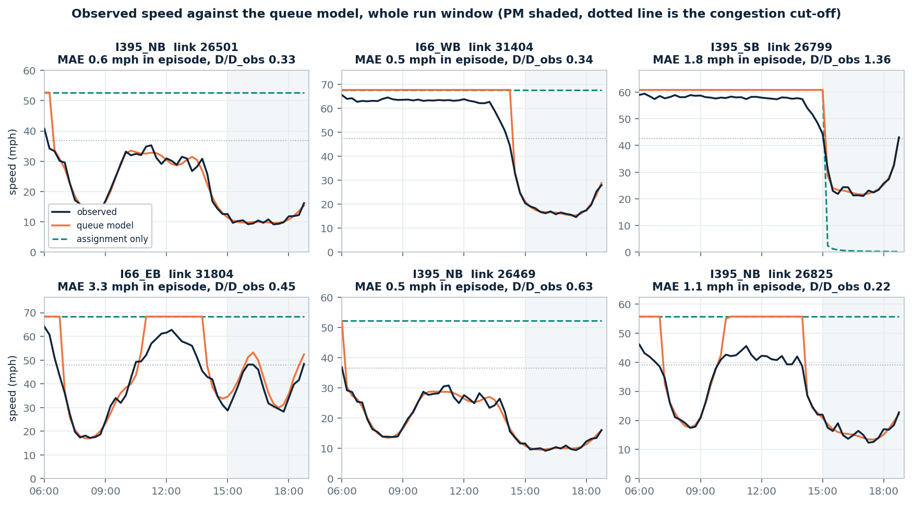
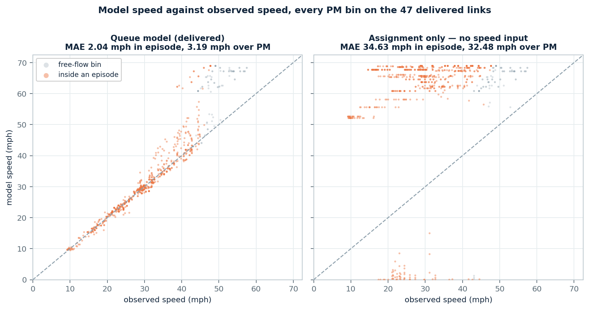
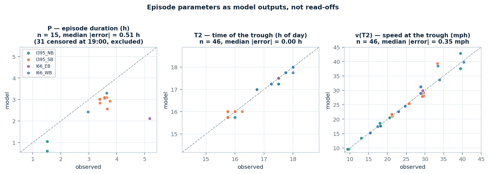
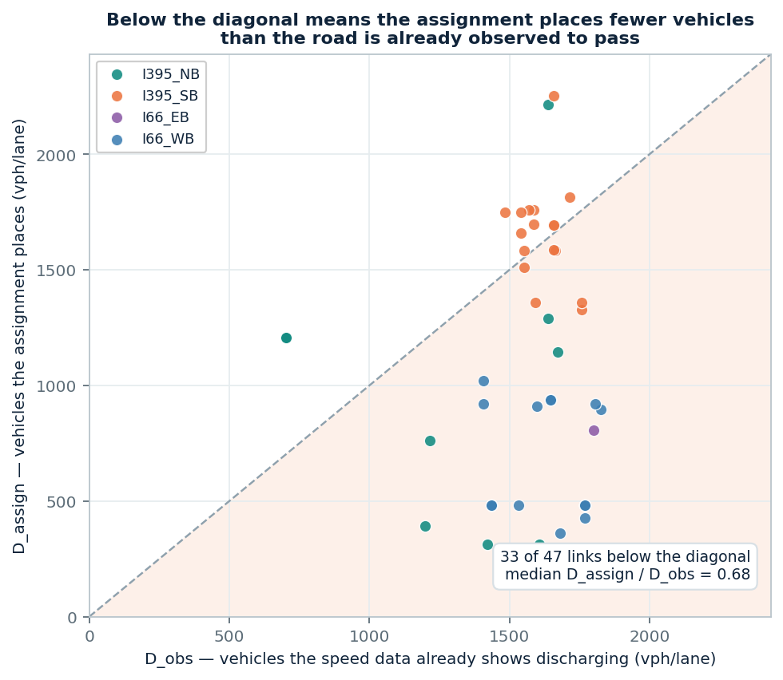

# NVTA PM, per network link: D, C, observed speed(t), back-calculated speed(t) from the single-link queue

Four corridors — I-395 NB/SB, I-66 EB/WB — average weekday, 23 October 2025
weekdays at 15 minutes. **47 links carry an observed PM episode; the model
reproduces one on 46 of them.**

This is the same list of quantities as the earlier QVDF delivery, in the same
column names, so the two summaries can be read side by side. **What changed is
where P, T2 and v(T2) come from.** Previously they were read off the observed
profile and a curve was redrawn through them. Here they are outputs of the queue
recurrence, extracted from the model's own speed by the same detector that ran on
the observation.

| File | Rows × cols | What is in it |
|---|---|---|
| `outputs/nvta_queue_pm/nvta_queue_pm_link_summary.csv` | 47 × 25 | one row per link with a PM episode: `D_assign`, `D_obs`, `C`, the observed and modelled `P`/`T2`/`v(T2)`, their errors, and the speed MAE |
| `outputs/nvta_queue_pm/nvta_queue_pm_speed_15min.csv` | 13,104 × 18 | one row per link and 15-minute bin: `obs_speed_mph`, `model_speed_mph`, `assignment_only_speed_mph`, both queues |
| `outputs/nvta_queue_pm/nvta_queue_pm_link_full.csv` | 756 × 62 | all 252 links, all three periods, every diagnostic — see [the appendix](NVTA_PM_LINK_QUEUE_APPENDIX.md) |

The series file carries the whole 06:00–19:00 run window, not just PM, because
the PM queue normally builds before 15:00 — the model is one continuous
recurrence and nothing resets at the period boundary.

---

## The chain, step by step

Each step is one operation. Only the mainline is here; everything else is in the
appendix.

**1 — Speed to flow.** The S3 fundamental diagram, `m = 4`, turns each observed
speed into a flow. Verified: `q/C` peaks at exactly 1.000 where `v/v_f = 0.707`,
as the formula requires.

**2 — Service rate μ.** Two regimes per link: `μ_free` before breakdown, `μ_queued`
inside an episode. The measured capacity drop is **6.83%** (IQR 3.7–10.9). Free
speed is each TMC's own observed 95th percentile, not the assignment's value —
the assignment's free speed is higher than the road's own observed maximum on
**72 of 154 TMCs**, so it cannot be used to set the congestion cut-off.

**3 — Speed to queue.** `Q_meas(t) = μ(t)·(L/v(t) − L/v_f)`. This is the fitting
target: how many vehicles must be queued to explain the delay the speed shows.
Peak queue is 46 vehicles at the median, and **no link ever exceeds its physical
storage**.

**4 — Arrival rate λ, where the queue identifies it.** λ is fitted so the
recurrence reproduces `Q_meas`, using 27 B-spline coefficients against 96 bins —
fewer parameters than data, so the fit can fail. It does not: correlation
**0.9842**, residual 4.1% of peak. **λ is identifiable on only 5.6% of bins** —
with no queue, `Q ≡ 0` holds for any λ below μ.

**5 — The other 94.4%, anchored on the assignment.** `Σλ·Δt = V_assign` over each
period, distributed across the free-flow bins. This is where the assignment
enters the model.

**6 — Run the queue.** `out = min(μ, λ + Q/Δt)`, `Q(t+Δt) = max(0, Q + (λ−out)Δt)`,
one continuous run from 06:00 with `Q(06:00) = 0`. Model peak queue is **0.962×**
the target.

**7 — Queue back to speed.** `TT = L/v_f + Q/μ`, `v̂ = L/TT`. **Nothing is fitted
in this step.** The episode detector is then run on `v̂` to extract P, T2 and
v(T2).

---

## Observed against back-calculated speed



Three lines per panel. Black is observed, orange is the delivered model, and the
dashed teal line is the same recurrence driven by `V_assign` alone with no speed
information — that variant is the subject of the next section.

Every PM bin on all 47 links, on 45-degree axes:



The left panel is the delivered model and follows the diagonal down into the
congested range. The right panel is the same recurrence with the assignment's
volumes as its only input: it collapses into a horizontal band at free flow,
because that demand never reaches μ and so no queue forms — the observed speed
drops from 50 mph to 10 while the model stays at 65. The scattering along the
bottom is the opposite failure, the handful of links where `V_assign` exceeds
what the free-flow bins can absorb.

Two features of the left panel are structural rather than error. The points above
the diagonal at 40–58 mph observed are bins where the model is pinned at `v_f`
because its queue is empty — a point queue has nothing to say about free-flow
speed variation. And the model can never exceed `v_f`, while the observation does
on roughly one bin in twenty, since `v_f` is a 95th percentile.

| Corridor | Links | D_assign | D_obs | D ratio | P observed | v(T2) observed | MAE in episode |
|---|---:|---:|---:|---:|---:|---:|---:|
| I-395 NB | 9 | 1,144 | 1,422 | 0.68 | 5.79 h | 18.1 mph | 1.62 mph |
| I-395 SB | 18 | 1,677 | 1,624 | **1.02** | 3.71 h | 29.0 mph | 2.12 mph |
| I-66 EB | 1 | 807 | 1,800 | 0.45 | 5.18 h | 29.4 mph | 3.32 mph |
| I-66 WB | 19 | 480 | 1,647 | **0.34** | 4.61 h | 28.8 mph | 2.16 mph |
| **all** | **47** | **1,020** | **1,638** | **0.68** | **4.25 h** | **25.8 mph** | **2.05 mph** |

D is per lane per hour over the 15:00–19:00 PM window; `C = 1,900` vph/lane at
the median.

## What earns the 2.05 mph

The headline number cannot say on its own what produced it, so the same
recurrence and the same queue-to-speed map were run on two other arrival
profiles:

| Variant | λ from | MAE inside the episode |
|---|---|---:|
| free flow | λ low enough that no queue ever forms — the null | 31.72 mph |
| **assignment only** | `V_assign / period hours`, flat, **no speed input at all** | **31.72 mph** |
| **anchored (delivered)** | the queue fit where λ is identifiable, `V_assign` elsewhere | **2.05 mph** |

| | |
|---|---:|
| what the assignment adds over the null | **+0.00 mph** |
| what the speed data adds over the assignment | **+29.66 mph** |

The assignment-only variant is indistinguishable from predicting free flow
everywhere. The reason is in the demand: its λ sits at **0.448 × μ** at the
median, and on **249 of 252 links** it never reaches μ at any bin, so no queue can
form. That is the flat dashed line in the profile figure and the horizontal band
in the right-hand scatter above. (On one panel — I-395 SB link 26799 — the dashed
line collapses to zero instead: there `V_assign` exceeds what the free-flow bins
can absorb, the other failure direction.)

**So the 2.05 mph is carried entirely by the speed data, which step 4 already
fitted against.** The number measures how self-consistent the loop is, not how
well the model predicts.

## P, T2 and v(T2)



| Quantity | n | Median error | Median absolute error |
|---|---:|---:|---:|
| **P** — duration | 15 | −0.51 h | 0.51 h |
| **T2** — time of trough | 46 | +0.00 min | 0.00 min |
| **v(T2)** — speed at trough | 46 | −0.09 mph | 0.35 mph |

T2 is exact on **28 of 46** links; v(T2) is within 1 mph on **37 of 46**. Episode
detection itself: 47 observed, 46 modelled, **46 matched — one missed, none
invented**.

P is only comparable on the 15 links whose model episode closed before 19:00. The
run window ends there because the assignment has no night period, so an episode
still active at 19:00 has no recovery time and its duration is a window artefact,
not a prediction. Those 31 links are excluded rather than scored.

These three now being outputs is the substantive change from the earlier
delivery. The caveat above still applies to all three: λ was fitted to the queue
the observed speed implies, so the agreement is inherited from that fit.

## Where D does not agree



`D_obs` is a hard floor, and it does not come from the assignment: it is the
volume the speed data already shows discharging through the link while it was
queued. The assignment cannot legitimately be below it.

**It is below it on 33 of 47 links, by a median factor of 0.68.** The corridor
split is sharp and is the most useful thing in this delivery:

| | D ratio | Links below the floor |
|---|---:|---:|
| I-395 SB | **1.02** | 7 / 18 |
| I-395 NB | 0.68 | 6 / 9 |
| I-66 EB | 0.45 | 1 / 1 |
| **I-66 WB** | **0.34** | **19 / 19** |

I-395 SB agrees. I-66 WB is short by a factor of three on every link — the
assignment places 480 vph/lane, 25% of capacity, on links the speed data shows
queued for 4.6 hours at the median. A road loaded to a quarter of capacity does
not queue for four hours. The S3 error on the congested branch is about 20%, far
too small to account for a factor of three.

One mechanism the single-link model structurally cannot represent is **spillback
from downstream**: a link can queue while its own demand is well below its own
capacity, because the queue reaches back from a bottleneck ahead of it. That is a
limit of the method, not a wrong input, and it is a candidate explanation for the
I-66 WB pattern specifically.

## What this establishes

**Established.** The recurrence, driven by an arrival profile consistent with the
observed queue, reproduces the timing and depth of PM congestion on these
corridors — T2 exact on 28 of 46 links, v(T2) within 1 mph on 37 of 46, one
missed episode and no false ones. The episode parameters are model outputs, which
they were not in the earlier delivery.

**Not established.** That the chain predicts. λ was fitted to the queue implied by
the observed speed, so speed enters at step 4 and comes back out at step 7; the
2.05 mph measures the loop's self-consistency. The assignment volumes contribute
nothing measurable, because at 45% of capacity they cannot produce a queue at all.

**The open question this delivery raises.** For the chain to become a forward
prediction, `V_assign` has to be able to drive the queue on its own. Today it is
short of the observed discharge by a median factor of 0.68, and by a factor of
three on all 19 I-66 WB links. Closing that gap — or explaining it as spillback —
is the next step, and it is separable by corridor.

---

```powershell
python scripts/make_nvta_queue_pm_tables.py
python scripts/make_nvta_queue_pm_figures.py
```

Steps 1–8 themselves: `scripts/queue_step1_flow_from_speed.py` through
`queue_step8_validation.py`, each writing a `step*_summary.json` next to its
output with the full statistics for that step.
