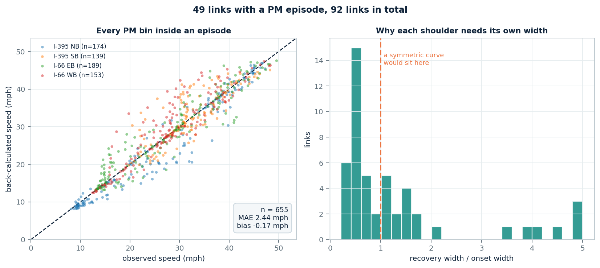
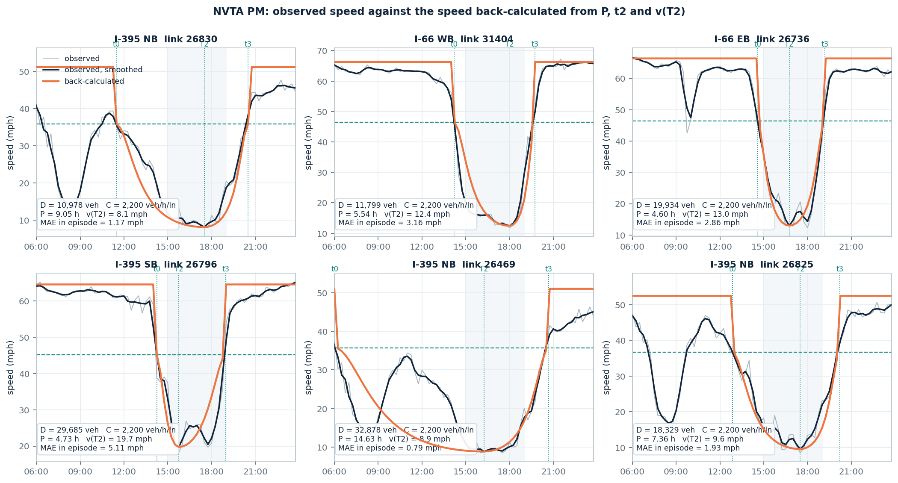

# NVTA PM period, per network link: D, C, observed speed(t), back-calculated speed(t)

Four corridors — I-395 NB/SB, I-66 EB/WB — **92 network links**, PM on the
assignment clock (15:00–19:00), average weekday 2025-10-06 to 10-10.

| File | Rows × cols | What is in it |
|---|---|---|
| `outputs/nvta_pm_link_speed/nvta_pm_link_speed_15min.csv` | 8,832 × 12 | one row per link and 15-minute bin: `obs_speed_mph`, `obs_speed_smoothed_mph`, `backcalc_speed_mph`, `in_episode`, `in_pm_period` |
| `outputs/nvta_pm_link_speed/nvta_pm_link_summary.csv` | 92 × 22 | one row per link: `D`, `C`, `D_over_C_h`, `P_h`, `t0`, `T2`, `t3`, `v_T2`, the speed errors, and a `note` on the links that need one |
| `outputs/nvta_pm_link_speed/nvta_pm_link_summary_full.csv` | 92 × 42 | the same, plus the working columns behind the two changes below — the config-70 mph figures and the CBI parameters |

The whole day is in the series file with PM flagged, because the PM queue
normally builds before 15:00 and clears after 19:00 — clipping it to the window
would cut the episode in half.

---

## How the back-calculated speed is built

Three numbers are read off the observed profile — **t0** when the queue forms,
**T2** when speed bottoms out, **t3** when it clears — plus the speed at the
trough, **v_T2**. Everything else is discarded and the curve is redrawn from
those four:

$$v(t)=\frac{v_c}{1+z\left(1-\tau^2\right)^2},\qquad z=\frac{v_c}{v_{T2}}-1$$

where $\tau$ measures the distance from the trough in shoulder-widths, so that
$\tau=0$ at T2 and $\tau=\pm 1$ at the two edges:

| | $\tau(t)$ |
|---|---|
| before the trough, $t\lt T_2$ | $(t-T_2)\,/\,(T_2-t_0)$ |
| after the trough, $t\ge T_2$ | $(t-T_2)\,/\,(t_3-T_2)$ |

Outside `[t0, t3]` the back-calculated speed is the free-flow speed, matching the
CBI convention.

Two points of construction differ from the textbook form, both deliberate.

**`v_c` is the congestion cut-off `0.70·v_f`, not the S3 speed at capacity
`v_f/√2`.** The curve is pinned at `v = v_c` when `τ = ±1`, and the episode is
*defined* as the stretch below the cut-off, so only the cut-off puts the curve's
edges on the episode's edges. At a 70 mph free-flow speed the two candidates are
49.00 and 49.50 — 1% apart, which is why this has never surfaced.

**Each shoulder gets its own width.** The usual `τ = 2(t−T2)/P` carries a single
P, which forces recovery to take exactly as long as onset. It does not:



The recovery-to-onset ratio has a **median of 0.70 and an IQR of 0.48–1.57** — a
symmetric curve needs it to be 1.00 on every link. Feeding an observed T2 into a
symmetric curve moves the trough but still pins it midway between the shoulders,
so it does not fix this. Scored against the CBI reconstruction of these same
corridors, letting the shoulders differ takes the median residual from
**0.72 mph to 0.24 mph**.

## Results

| Corridor | Links | With a PM episode | P median | v_T2 median | D median (veh/lane) | D/C median | Speed MAE |
|---|---:|---:|---:|---:|---:|---:|---:|
| I-395 NB | 19 | 14 | 4.22 h | 27.1 mph | 5,726 | 2.60 h | 1.23 mph |
| I-395 SB | 19 | 10 | 3.31 h | 27.9 mph | 6,376 | 2.90 h | 2.59 mph |
| I-66 EB | 31 | 15 | 3.88 h | 24.4 mph | 6,008 | 2.73 h | 2.18 mph |
| I-66 WB | 23 | 10 | 5.55 h | 26.2 mph | 7,277 | 3.31 h | 2.69 mph |



Speed agreement, median link: **2.18 mph MAE inside the episode**, 4.59 mph
across the whole PM period. The gap between the two is the step at t0 and t3,
where the model leaves the curve and jumps to free flow.

### What 2.18 mph does and does not establish

t0, T2, t3 and v_T2 are all read off the observation, so the depth and the timing
of the trough match by construction and only the shape between the anchors is
under test. To see how much of the fit that shape is actually earning, the same
four anchors were joined by two cruder things:

| Drawn between the same anchors | Median MAE | Median RMSE |
|---|---:|---:|
| **QVDF bowl** (delivered) | **2.18 mph** | 2.78 mph |
| straight lines, t0 → T2 → t3 | 3.16 mph | 4.04 mph |
| held flat at v_T2 | 4.93 mph | 6.14 mph |

So the shape is doing real work — QVDF beats the triangle on **35 of 49 links**,
by 0.78 mph at the median. But note the split: using the anchors sensibly at all
is worth 2.31 mph, and the shape family on top of that is worth 0.78. Most of the
agreement comes from the anchors.

Which is the limit of what this number establishes. It says the `(1−τ²)²` bowl
resembles real congestion better than a straight line does. It says nothing about
whether QVDF can produce P and v_T2 **from D/C**, because that chain was never
run here — the two quantities were measured, not predicted. In assignment use
there is no observed speed to read them from, so that chain is the one that has
to hold. Its calibrated form is `P = f_d·(D/C)^n` and `z = f_p·P^s`, and CBI
already carries all four parameters; its own speed-branch fit is a median
`speed_r2` of 0.178, with 61% of links below 0.3. Running it forward on these
links is the next step.

## Two things that changed

**The free-flow speed is now each link's own, not 70 mph everywhere.** This sets
the cut-off, which sets both D and the episode, so it is the most consequential
choice in the pipeline. It is now settled rather than assumed: our value is the
95th percentile of each link's own observed profile, CBI derived one by a
separate route, and on the **48 links they share**:

| | median | difference | correlation |
|---|---:|---:|---:|
| ours (observed p95) | 64.25 mph | **MAE 1.77 mph** | **0.961** |
| CBI (`free_flow_speed_model_mph`) | 65.40 mph | 83% within 3 mph | |

Two independent derivations landing within 2 mph is what retires the 70 mph
constant.

**The consequence: 49 links carry a PM episode here, against 76 called congested
in the delivered D/V table.** That is the correction, not a loss of coverage. The
old count tested every link against `0.70 × 70 = 49` mph; a link whose own
free-flow speed is 50 mph was therefore called congested while running 45. Under
its own cut-off of 35 mph it is not. The dropped links are all of that kind.

## One caveat

On **3 links** — 26469, 26830, 29007, all I-395 NB — the morning and evening
peaks were joined into a single episode, because speed never recovered above
`0.75·v_f` in between. Their `P` is an all-day duration, up to 14.6 h, and one
curve is a poor description of two peaks. The flags
`episode_starts_before_noon` and `episode_longer_than_the_pm_window` mark these
in the summary. D, C and the observed speed are unaffected.

---

```powershell
python scripts/run_nvta_pm_link_speed.py
python scripts/make_pm_link_speed_figure.py
```
